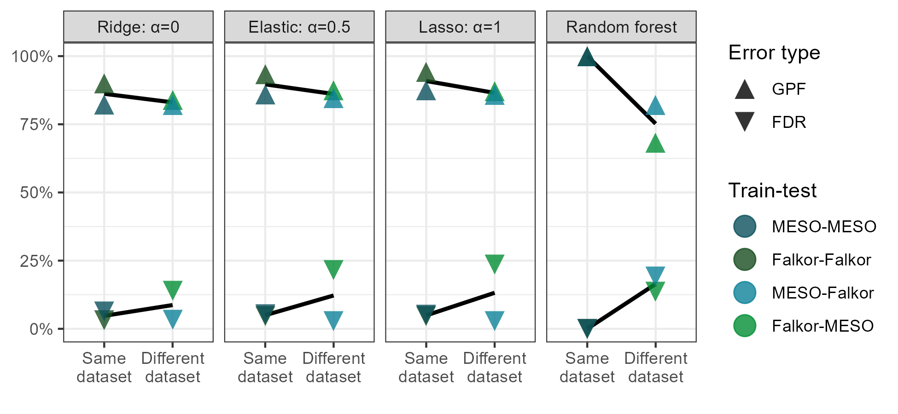

```{r setup, include=FALSE}
knitr::opts_chunk$set(echo = FALSE)
knitr::opts_knit$set(root.dir = '..')
options(readr.show_col_types = FALSE)
options(tidyverse.quiet = TRUE)
library(tidyverse)
library(RaMS)
```

```{r load data}
file_data <- read_csv("made_data_MS3000/file_data.csv") %>%
  mutate(depth=factor(depth, levels=c("15m", "DCM", "175m"))) %>%
  mutate(filename=basename(filename))
FT2040_features <- read_csv("made_data_FT2040/features_extracted.csv")
MS3000_features <- read_csv("made_data_MS3000/features_extracted.csv")
Pttime_features <- read_csv("made_data_Pttime/features_extracted.csv")
CultureData_features <- read_csv("made_data_CultureData/features_extracted.csv")

dataset_versions <- c("FT2040_features", "MS3000_features")

raw_data_params <- c("med_cor", "med_SNR")
xcms_params <- c("mean_mz", "sd_ppm", "mean_rt", "sd_rt", "mean_pw", 
                 "sd_pw", "log_mean_area", "log_sd_area", "sn", 
                 "f", "scale", "lmin", "feat_npeaks", "n_found", 
                 "samps_found", "stans_found")
all_params <- c("mean_mz", "sd_ppm", "mean_rt", "sd_rt", "mean_pw", "sd_pw",
                "log_mean_area", "log_sd_area", "sn", "f", "scale", 
                "lmin", "feat_npeaks", "n_found", "samps_found", "stans_found", 
                "med_cor", "med_SNR", "med_missed_scans", "smp_to_blk", 
                "smp_to_std", "shape_cor", "area_cor", "feat_class")
```

## Abstract

### Background 

Chromatographic peakpicking continues to represent a significant bottleneck in automated LC-MS workflows. Uncontrolled false discovery rates and the lack of manually-calibrated quality metrics require researchers to visually evaluate individual peaks, requiring large amounts of time and breaking replicability. Here, we manually labeled two oceanographic particulate metabolite datasets to assess the performance of individual peak quality metrics and constructed a predictive model calibrated to the likelihood that visual inspection by an MS expert would include a given mass feature in the downstream analysis. 

### Results

A simple logistic regression model built on two metrics calculated from the raw MS data reduced the fraction of false positives in the analysis from 80-90% down to 1-5% and showed minimal overfitting when applied to novel datasets. We then explored the implications of this quality thresholding on the conclusions obtained by the downstream analysis, concluding that the poor performance of peakpicking algorithms significantly reduces the power of both univariate and multivariate statistical analyses in detecting environmental differences. We finally show that depth is a major driver of variability in the metabolome in high-quality environmental metabolomics datasets and identify several interesting metabolite groups for future investigation.

### Conclusions

TBD


## Background

Liquid chromatography-mass spectrometry (LC-MS) is a powerful tool for exploring the molecular composition of biological samples. Its rapid sample processing (typically <1 hr run time), low limits of detection (pM-nM range), and ability to characterize novel molecules via fragmentation fingerprints make it a common workhorse for metabolomic research. However, much of the data produced by these instruments goes unused because traditional workflows target only a fraction of the compounds detected based on an *a priori* list of known molecules. Significant efforts in the past two decades have established workflows for untargeted metabolomics [@xcms, @mzmine, @msdial], but these data-driven methods are still handicapped by the poor performance of the core peakpicking algorithms and require manual oversight and curation of the datasets after they're produced by the software. This peakpicking step is typically the very first in the data processing stage, with implications for all downstream analysis and interpretation. [Mention HILIC chromatography specifically to justify its use here?]

Peakpicking is a well-known problem across many fields of science and especially in LC-MS analysis due to the smooth transition from high-quality peaks into background noise as the limit of detection is approached and crossed, with background signals often sharing many features of high-quality peaks. The imperfection of these algorithms introduces a fundamental tradeoff between false positives and false negatives, where false positives (Type I errors) represent background instrument or chemical noise that has been misclassified as true biological signal and false negatives (Type II errors) indicating biological signals that are misclassified as noise. Existing algorithms tend to be very forgiving of Type I errors and very harsh on Type II, presenting many false positives to the researcher in their attempt to absolutely minimize the number of real molecules missed. This approach makes sense because downstream analyses can always remove additional mass features, but Type II errors cannot be later recovered. However, we would argue that this emphasis on an absolute minimization of the missed peaks does a disservice to scientists for two reasons. First, the abundance of false positives means that peakpicking output cannot be automatically trusted. This mandates manual evaluation of the raw data, a time-consuming and mind-numbing process with a large degree of subjective decision making that cannot be perfectly replicated and scales combinatorially with the number of samples and compounds measured. Second, the presence of false negatives cannot be fully accounted for in the way the false positive rate can. False negatives are introduced in every step of metabolomic analyses, with compounds lost during sample processing, injection, and detection on the instrument. This is a well-known problem in metabolomics and will not be solved by any perfecting of peakpicking algorithms. Instead, emphasis should be placed on allowing the experimenter to set an acceptable threshold for the false discovery rate and accepting that this will inherently add to the number of peaks already lost in the data collection process.

Existing peak-detection softwares do not provide a clear way to do this. Typical outputs consistent across the different implementations consist of the *m/z* ratio, retention time, and area for each molecular feature, with some additional useful information occasionally provided such as the peak's signal-to-noise ratio or degree of skew which are rarely estimated using a well-documented algorithm. None of these parameters answer the critical question of interest: what is the likelihood that this subset of data corresponds to an actual molecule present in the original sample? This parameter is crucial for downstream analysis because it represents the base rate for error propagation and acceptable thresholds should vary widely by the particular project's goals. In an exploratory analysis, any molecular feature more than 50% likely to be real is perhaps worth considering, while in a confirmatory study this threshold may need to be above 99%. While significant effort has been recently invested into improvements in the peakpicking algorithms, very little has been done to quantify the accuracy and precision of their outputs on the wide variety of datasets from which they are determined.

A single metric of peak quality calibrated to its likelihood of representing an actual molecule has multiple advantages over the current heuristic approaches. First, providing an intuitive metric of peak goodness allows researchers to focus their energy on those features least likely to be noise and most likely to be found in a repeated analysis. This applies both during the manual curation phase in which the very best or most interesting peaks can be visually inspected while those of poor quality can be discarded, as well as in the compound discovery/characterization steps where time and energy spent attempting to determine the structure or molecular formula of a noise signal is wasted. Second, removing low-quality noise signals from the dataset prior to downstream analysis should improve statistical power by reducing the number of hypotheses tested for univariate analyses and increasing the relative power of significant peaks in multivariate analyses. Third, such a metric would allow optimization of peakpicking and chromatographic parameters for untargeted datasets. Rather than measuring the effect of a change on a small subset of known molecules or by counting the total number of peaks found, one could look at the metric's distribution to see whether the change was an improvement in the number and absolute quality of the peaks detected. Fourth, high quality peaks should be independent of software implementations and should be found no matter what algorithms are used, relieving the scientist (and reviewers!) of some of the burden of learning new software or programming languages to check their work. Fifth, this metric would enable more consistent quality control between labs and analyists. Rather than discussing a plethora of parameters or making subjective assessments of peak shape, an idealized metric would provide a simple and intuitive threshold upon which to agree for a given project. This metric would be scripted and provide consistent, reproducible results independent of the particular expert reviewing its performance.

A single comprehensive metric also has significant advantages over multiple individual thresholds. First, a metric calibrated to likelihood is easier and more intuitive to use for classification than relatively arbitrary thresholds of signal-to-noise or peak skewness with ambiguous units and unintuitive interpretations. Second, a single compound metric also has the multivariate advantage over independent thresholds by allowing a good peak to be weak in one area which is compensated for by strong performance in other metrics. Sometimes good peaks do have high SNR or small areas, and thresholding on these metrics independently unnecessarily increases the likelihood of missing signals. Finally, the relative power of these many different metrics is difficult to compute and hard to compare. Is it more important to have an isotope, or a Gaussian peak shape? Is it more likely to be a biological signal if it has a large area, or if it differs between treatment? If so, by what degree? These metrics differ in strength depending on the dataset, but many MS experts have some degree of heuristic knowledge about their relative power for the data they've worked with and analyzed.

An area particularly ripe for LC-MS analysis is that of the open ocean. Low compound and high salt concentrations make this area difficult to study [@BMIS] but its vast size and direct effect on the Earth's carbon cycling make it critical that we understand its dynamics of energy and nutrients on a molecular scale. Metabolites are the currency of chemical exchange both intra- and inter-cellularly, serving as building blocks of larger molecules, regulators of osmotic balance and storage of nutrients, as well as chemical signals on their own. These small molecules serve both as signposts for the complex biological landscape in this highly dynamic region and give a sense of not only who is present but also what ecological roles they're serving and the niches they fill.

In this paper, we use open ocean marine metabolite LC-MS samples to develop and test a variety of chromatographic peak metrics. Here, we construct and validate multiple predictive models of peak quality based on metrics both common in the literature and custom implementations we've found useful in our own analysis. This allows us to connect the physical, chemical, and biological measurements taken regularly around the globe to a molecular-scale perspective of particular organic matter in the ocean by linking the chemical currencies that fuel the planet to the environments in which they're found.

## Results

```{r summary stats for pred_prob histograms, include=FALSE}
lst(FT2040_features, MS3000_features, Pttime_features, CultureData_features) %>%
  bind_rows(.id = "dataset") %>%
  with(table(dataset, feat_class)) %>%
  `/`(rowSums(.)) %>%
  round(2)

train_set <- rbind(FT2040_features, MS3000_features) %>%
  filter(feat_class%in%c("Good", "Bad")) %>%
  mutate(feat_class=feat_class=="Good")

both_min_model <- paste0("feat_class~", paste(raw_data_params, collapse = "+")) %>%
  glm(data = train_set, family = binomial)
both_xcms_model <- paste0("feat_class~", paste(xcms_params, collapse = "+")) %>%
  glm(data = train_set, family = binomial)
both_full_model <- paste0("feat_class~", paste(all_params, collapse = "+")) %>%
  glm(data = train_set, family = binomial)

pred_probs <- bind_rows(lst(
  Falkor=FT2040_features, MESOSCOPE=MS3000_features,
  CultureData=CultureData_features, Pttime=Pttime_features), 
  .id = "dataset") %>%
  mutate(pred_prob_min=predict(object=both_min_model,newdata = ., type = "response")) %>%
  mutate(pred_prob_xcms=predict(object=both_xcms_model,newdata = ., type = "response")) %>%
  mutate(pred_prob_full=predict(object=both_full_model,newdata = ., type = "response"))

pred_probs %>%
  select(starts_with("pred_prob")) %>%
  pivot_longer(cols = everything()) %>%
  mutate(pred_cuts=cut(value, breaks = c(0, 0.01, 0.1, 0.5, 0.9, 0.99, 1))) %>%
  with(table(name, pred_cuts))
```

### Dataset characterization

An average of 3,300 molecular features (MFs) were reported by XCMS across the 4 datasets, with the fewest (1495) in the Falkor data and the most in the Pttime samples (7781). In the Falkor and MESOSCOPE datasets that were fully labeled by an MS expert, approximately 70% (69% and 73%, respectively) of the features were given a "Bad" designation, corresponding to noise peaks that the expert would not have included in a downstream analysis. In both, 5% of the MFs were unable to be assigned confidently to either "Good" or "Bad" classes and 10% were identified as appearing only in the standards, leaving only ~15% of the features classified as "Good" (16% and 12%, respectively). 


### Logistic regression performance

We used three different multiple logistic regression models to predict the likelihood of each MF being categorized as "Good". The first model included all metrics calculated as described above in Methods, the second contained only those parameters immediately available from the XCMS output without revisiting the raw data (the four core peak metrics *m/z*, RT, peak width, area and their standard deviations plus the mysterious lmin, f, and scale values as well as the fraction of peaks, samples, and standards found), and the final model was a simple two-parameter model using only the peak shape and novel SNR metrics. In all three cases, the majority of MFs were estimated to have a less than 1% chance of being good. The full model and the XCMS model both displayed a strongly bimodal distribution, with a large number of peaks also exceeding a 99% chance of being good, while the two-parameter model had a flatter distribution with fewer high-confidence MF assignments and more intermediate values (Fig. 3).

```{r fig3 pred_prob_class_color_hists}
base_gp <- ggplot() +
  aes(x=pred_prob_min, fill=feat_class) +
  facet_wrap(~dataset, scales="free_y") +
  scale_fill_manual(breaks = c("Good", "Bad", "Meh", "Stans only", "Unclassified"),
                    values = c("#f4bb23", "#a41118", "#0b505c", "#028e34", "grey50")) +
  labs(x="Predicted probability", y="# of mass features", fill="Manual\nclassification") +
  theme_bw() +
  theme(axis.text.y.right = element_blank(),
        axis.ticks.y.right = element_blank(),
        legend.position = "none")
axis_breaks <- pred_probs %>%
  group_by(dataset) %>%
  mutate(pred_prob_min=cut(pred_prob_min, breaks=seq(0, 1, 0.02))) %>%
  count(pred_prob_min) %>%
  slice(1) %>%
  pull(n, dataset)
falk_hist_gp <- base_gp + 
  geom_histogram(breaks=seq(0, 1, 0.02), data = pred_probs %>% 
                   filter(dataset=="Falkor")) +
  scale_y_continuous(breaks = c(0, 50, 100, 150, 195),
                     labels = c(0, 50, 100, 150, axis_breaks["Falkor"])) +
  geom_vline(xintercept = 0.9, color="black", linewidth=1) +
  annotate("rect", xmin=0, xmax=1, ymin=180, ymax=185, fill="white", color="black") +
  annotate("rect", xmin=0, xmax=0.125, ymin=195, ymax=Inf, fill="white", color="grey90") +
  coord_cartesian(ylim = c(0, 200), expand = FALSE) +
  theme(axis.title.x = element_blank(), axis.text.x = element_blank())
meso_hist_gp <- base_gp + 
  geom_histogram(breaks=seq(0, 1, 0.02), data = pred_probs %>% 
                   filter(dataset=="MESOSCOPE")) +
  scale_y_continuous(breaks = c(0, 50, 100, 150, 200, 240),
                     labels = c(0, 50, 100, 150, 200, axis_breaks["MESOSCOPE"])) +
  geom_vline(xintercept = 0.9, color="black", linewidth=1) +
  annotate("rect", xmin=0, xmax=1, ymin=220, ymax=230, fill="white", color="black") +
  annotate("rect", xmin=0, xmax=0.125, ymin=240, ymax=Inf, fill="white", color="grey90") +
  coord_cartesian(ylim = c(0, 250), expand = FALSE) +
  theme(axis.title = element_blank(), axis.text.x = element_blank())
culture_hist_gp <- base_gp + 
  geom_histogram(breaks=seq(0, 1, 0.02), data = pred_probs %>% 
                   filter(dataset=="CultureData")) +
  scale_y_continuous(breaks = c(0, 50, 100, 116),
                     labels = c(0, 50, 100, axis_breaks["CultureData"])) +
  geom_vline(xintercept = 0.9, color="black", linewidth=1) +
  annotate("rect", xmin=0, xmax=1, ymin=110, ymax=113, fill="white", color="black") +
  annotate("rect", xmin=0, xmax=0.125, ymin=116, ymax=Inf, fill="white", color="grey90") +
  coord_cartesian(ylim = c(0, 120), expand = FALSE)
pttime_hist_gp <- base_gp + 
  geom_histogram(breaks=seq(0, 1, 0.02), data = pred_probs %>% 
                   filter(dataset=="Pttime")) +
  scale_y_continuous(breaks = c(0,100,200,300,400,510),
                     labels = c(0,100,200,300,400,axis_breaks["Pttime"])) +
  geom_vline(xintercept = 0.9, color="black", linewidth=1) +
  annotate("rect", xmin=0, xmax=1, ymin=470, ymax=485, fill="white", color="black") +
  annotate("rect", xmin=0, xmax=0.125, ymin=510, ymax=Inf, fill="white", color="grey90") +
  coord_cartesian(ylim = c(0, 520), expand = FALSE) +
  theme(axis.title.y = element_blank())
egg_grob <- egg::ggarrange(falk_hist_gp, meso_hist_gp, culture_hist_gp, pttime_hist_gp, draw = FALSE)
egg_legend <- cowplot::get_legend(culture_hist_gp + theme(legend.position = "right"))
egg_complete <- cowplot::plot_grid(egg_grob, egg_legend, rel_widths = c(1, 0.25)) +
  theme(plot.background = element_rect(fill = "white", color=NA))
ggsave(plot = egg_complete, 
       filename = "manuscript/figures/pred_prob_class_color_hists.png", 
       device = "png",
       width = 6.5, height = 4, units = "in", dpi = 300)
```

![Figure 3: Histograms showing the estimated likelihood of a given mass feature being categorized as "Good" according to the two-parameter logistic model trained on the combined fully-labeled Falkor and MESOSCOPE datasets. Colors indicate the category in which each feature was manually assigned by an expert, with "Stans only" referring to a good peak that was only visible in the standards run alongside the samples. Datasets CultureData and Pttime were manually labeled only for those features with an estimated likelihood above 90% (black vertical line) and were otherwise unclassified.](figures/pred_prob_class_color_hists.png){width=90%}

In each case, we determined each molecular feature as a true positive (TP) if it was predicted to be Good and was manually classified as Good, a true negative if both predicted and classifed as Bad, a false positive if predicted to be Good but manually classified as Bad, and a false negative if predicted to be Bad but was in fact manually classified as Good. This allowed us to additionally define two useful measures of success, the traditionally-defined false discovery rate (FDR, defined as 1-precision or the number of false positives divided by the total number of predicted positives) and the percentage of good peaks found (GPF, also known as the recall or sensitivity and defined as the number of true positives divided by the total number of positive predictions). These two measures allowed us to monitor two key questions typically asked of a predictive model in this context: first, what fraction of the data predicted to be good is actually noise; and second, what fraction of the good data am I actually recovering in the downstream analysis?

The full model performed very well when tested internally on the same dataset both during 80/20 cross validation and when [predicting] using the full dataset, with FDR values in the 5-10% range and 80-90% GPF values implying that a large majority of the good peaks passed the threshold. The XCMS metrics performed slightly worse, with FDR values in the 10-15% range and GPF values closer to 75%. The two-parameter model performed worst when tested internally, with an FDR of about 20% and %GPF also around 75% (Figure 4). However, when the models were trained on a different dataset than the one they were used to predict classifications for, nearly all models had similar performance with %FDR around 10-25 and %GPF around 60-80. This dramatic drop in performance on out-of-training data strongly implied that the full and XCMS-only models were highly overfit, while the two-parameter model had probably reached stability. Also notably, the model trained on MESOSCOPE and tested on Falkor had consistently higher values, indicating that it was favoring more peaks recovered at the cost of a higher FDR, while the reverse was true for the model trained on Falkor and tested on MESOSCOPE [and it's unclear why this should be the case] (Figure 4). 

```{r FDR vs GPF cross-train triangle figure feature selection}
fdr_gpf_cross_train_df <- lst(all_params, raw_data_params, xcms_params) %>%
  imap(function(param_selection, param_name){
    lapply(dataset_versions, function(train_set){
      full_model <- get(train_set) %>% 
        filter(feat_class%in%c("Good", "Bad")) %>%
        select(feat_class, all_of(param_selection)) %>%
        mutate(feat_class=feat_class=="Good") %>%
        glm(formula=feat_class~., family = binomial)
      lapply(dataset_versions, function(test_set){
        get(test_set) %>%
          mutate(pred_prob=predict(object=full_model,newdata = ., type = "response")) %>%
          mutate(pred_class=ifelse(pred_prob>0.5, "Good", "Bad")) %>%
          select(feat_class, starts_with("pred_class")) %>%
          mutate(train_test=paste(train_set, test_set, sep = "-")) %>%
          mutate(train_test=str_remove_all(train_test, "_features")) %>%
          mutate(cross_type=ifelse(train_set==test_set, "Same", "Different"))
      }) %>% bind_rows()
    }) %>% bind_rows() %>% mutate(which_params=param_name)
  }) %>% bind_rows() %>%
  mutate(error_type=case_when(
    feat_class=="Bad" & pred_class=="Bad" ~ "TN",
    feat_class=="Bad" & pred_class=="Good" ~ "FP",
    feat_class=="Good" & pred_class=="Bad" ~ "FN",
    feat_class=="Good" & pred_class=="Good" ~ "TP"
  )) %>%
  group_by(train_test, which_params, cross_type) %>%
  count(error_type) %>%
  ungroup() %>%
  mutate(cross_type=factor(cross_type, levels=c("Same", "Different"))) %>%
  pivot_wider(names_from=error_type, values_from = n) %>%
  mutate(FDR=FP/(FP+TP)) %>%
  mutate(GPF=TP/(FN+TP)) %>%
  pivot_longer(c(FDR, GPF)) %>%
  mutate(name=paste0("%", name)) %>%
  mutate(which_params=factor(which_params, 
                             labels=c("All metrics", "XCMS metrics", "Raw data metrics"),
                             levels=c("all_params", "xcms_params", "raw_data_params"))) %>%
  mutate(cross_type_num=as.numeric(cross_type))

train_test_levels <- c("MS3000-MS3000", "FT2040-FT2040", "MS3000-FT2040", "FT2040-MS3000")
train_test_labels <- c("MESO-MESO", "Falkor-Falkor", "MESO-Falkor", "Falkor-MESO")
fdr_gpf_cross_train_gp <- fdr_gpf_cross_train_df %>%
  mutate(train_test=factor(train_test, levels=train_test_levels, labels=train_test_labels)) %>%
  mutate(name=factor(name, levels=c("%GPF", "%FDR"), labels=c("GPF", "FDR"))) %>%
  ggplot() +
  geom_point(aes(x=cross_type, y=value, color=train_test, 
                 fill=train_test, shape=name), size=5) +
  geom_smooth(aes(x=cross_type_num, y=value, group=name), 
              method = "lm", formula="y~x", color="black", se=FALSE) +
  facet_grid(~which_params) +
  scale_x_discrete(labels = c("Same\ndataset\n", "Different\ndataset\n"),
                   breaks = c("Same", "Different")) +
  scale_color_manual(values = c("#0b505c", "#184d1f", "#0d8299", "#028e34"), 
                     breaks = train_test_labels,
                     aesthetics = c("color", "fill")) +
  scale_shape_manual(breaks = c("GPF", "FDR"), values = c("\u25B2", "\u25BC")) +
  coord_cartesian(ylim = c(0, 1)) +
  scale_y_continuous(labels = scales::label_percent()) +
  theme_bw() +
  theme() +
  labs(x=NULL, y=NULL, color="Train-test", fill="Train-test", shape="Error type") +
  guides(shape=guide_legend(order=1))

ggsave(plot = fdr_gpf_cross_train_gp, 
       filename = "fdr_gpf_cross_train.png", 
       device = "png", path = "manuscript/figures",
       width = 6.5, height = 3, units = "in", dpi = 300)
```

![Figure 4: False discovery rate (%FDR) and fraction of good peaks found (GPF) plotted across different subsets of model parameters. Lower %FDR indicates a smaller fraction of false positives among those peaks the model categorized as "Good" using a threshold of 0.5, and higher %GPF indicates a larger fraction of the total good peaks were found using the same threshold. Points are colored by the model used for training and testing, with internal validation (using the same dataset for training as prediction) in the darker colors on the left and external validation (using a different dataset for training than prediction) in the lighter colors on the right of each panel. Lines of best fit have been estimated and plotted in black on top of the data points.](figures/fdr_gpf_cross_train.png){width=90%}

### Model stability under different training sets and subset of labels

To further explore questions of model stability and the potential for overfitting, we compared the predictions from a Falkor-trained model to a MESOSCOPE-trained model. In the ideal situation, these predictions are the same because the values are independent of a given training set's quirks, but this was not what we found for the full and XCMS-only models (Figure 5). We compared the absolute likelihood values using Pearson's correlation coefficient and found that the two-parameter models had the highest $r$ value of 0.996, while the full models and the XCMS-trained models had $r$ values of 0.856 and 0.896, respectively (Figure 5). Finally, we compared the model likelihoods in ranked space with Spearman's correlation coefficient to test the question of whether or not the *ranking* was similar even if the absolute values differed. Here, we found an intensification of the effect described before, with an even higher $r$ for the two-parameter model of 0.998 but lower $r$ values for the full and XCMS-trained model of 0.818 and 0.849, respectively (Figure 5).

```{r red/gold rank dotplot step-down method}
dotplot_stepdown_data <- lst(all_params, xcms_params, raw_data_params) %>%
  imap(function(param_selection, param_name){
    lapply(dataset_versions, function(train_set){
      model_i <- get(train_set) %>% 
        filter(feat_class%in%c("Good", "Bad")) %>%
        select(feat_class, all_of(param_selection)) %>%
        mutate(feat_class=feat_class=="Good") %>%
        glm(formula=feat_class~., family = binomial)
      MS3000_features %>%
        mutate(pred_prob=predict(model_i, ., type="response")) %>%
        select(feature, feat_class, pred_prob) %>%
        mutate(which_params=param_name) %>%
        mutate(training_set=train_set)
    }) %>% bind_rows()
  }) %>% bind_rows()

stepdown_cors <- dotplot_stepdown_data %>%
  group_by(training_set, which_params) %>%
  pivot_wider(names_from = training_set, values_from = c(pred_prob)) %>%
  summarize(pcor=cor(FT2040_features, MS3000_features, method = "pearson"),
            scor=cor(FT2040_features, MS3000_features, method = "spearman"))

raw_prob_space_gp <- dotplot_stepdown_data %>%
  pivot_wider(names_from = training_set, values_from = pred_prob) %>%
  filter(feat_class%in%c("Good", "Bad")) %>%
  mutate(which_params=factor(
    which_params, levels=c("all_params", "xcms_params", "raw_data_params"),
    labels=c("All metrics", "XCMS metrics", "Raw data metrics"))) %>%
  ggplot() +
  geom_abline(slope = 1, intercept = 0, color="black", lwd=1) +
  geom_point(aes(x=FT2040_features, y=MS3000_features, color=feat_class), alpha=0.2) +
  facet_wrap(~which_params, nrow = 1) +
  scale_fill_manual(values = c("#a41118", "#f4bb23"), breaks = c("Bad", "Good"), 
                    aesthetics = c("color", "fill")) +
  scale_x_continuous(breaks = c(0, 0.5, 1)) +
  scale_y_continuous(breaks = c(0, 0.5, 1)) +
  coord_fixed() +
  labs(x="Falkor-trained model (predicted probability)", 
       y="MESO-trained model\n(predicted probability)") +
  theme_bw() +
  theme(legend.position = "none",
        strip.background = element_rect(fill="white"))
rank_prob_space_gp <- dotplot_stepdown_data %>%
  group_by(training_set, which_params) %>%
  mutate(pred_prob=rank(pred_prob)) %>%
  pivot_wider(names_from = training_set, values_from = pred_prob) %>%
  mutate(which_params=factor(
    which_params, 
    levels=c("all_params", "xcms_params", "raw_data_params"),
    labels=c("All metrics", "XCMS metrics", "Raw data metrics"))) %>%
  filter(feat_class%in%c("Good", "Bad")) %>%
  ggplot() +
  geom_abline(slope = 1, intercept = 0, color="black", lwd=1) +
  geom_point(aes(x=FT2040_features, y=MS3000_features, color=feat_class), alpha=0.2) +
  facet_wrap(~which_params, nrow = 1) +
  scale_fill_manual(values = c("#a41118", "#f4bb23"), breaks = c("Bad", "Good"), 
                    aesthetics = c("color", "fill")) +
  scale_x_continuous(breaks = c(0, nrow(MS3000_features)), 
                     labels = c("Min rank", "Max rank")) +
  scale_y_continuous(breaks = c(0, nrow(MS3000_features)),
                     labels = c("Min\nrank", "Max\nrank")) +
  labs(x="Falkor-trained model (ranked likelihood)", 
       y="MESO-trained model\n(ranked likelihood)",
       color=NULL) +
  guides(color=guide_legend(override.aes = list(size=4, alpha=0.8))) +
  coord_fixed() +
  theme_bw() +
  theme(axis.text.x = ggtext::element_markdown(hjust=c(0, 1)),
        # strip.text = element_blank(),
        strip.background = element_rect(fill="white"),
        legend.position=c(0.875, 0.25),
        legend.background = element_blank(),
        legend.spacing.x = unit(0.003, units = "npc"))
comb_prob_space_gp <- egg::ggarrange(raw_prob_space_gp, rank_prob_space_gp, draw = FALSE)
ggsave(plot = comb_prob_space_gp, 
       filename = "comb_prob_space.png", 
       device = "png", path = "manuscript/figures",
       width = 6.5, height = 5, units = "in", dpi = 300)
```

{width=90%}

We also looked at the estimates produced by the two models and compared them with the combined model trained on the combined datasets to assess the model stability directly. A majority of the time, the estimates from the two models disagreed by more than 2x the standard error of the estimate and frequently disagreed by that amount depending on the other parameters included in the model. Some parameters disagreed not only in magnitude but also in sign, with the Falkor-trained full model increasing peak goodness likelihood with larger ppm variation and a wider peak width, while the MESOSCOPE-trained full model had negative estimates for each of these parameters. Notably, the peak shape and novel SNR parameters in the two-parameter model were among the most robust to training model variation, potentially explaining the consistency described above (Supp. figure 1).

We also tested the robustness of the model under a smaller training set, emulating a situation in which only a fraction of the data was available or only a portion of the mass features had been labeled. This allowed us to test the required sample size for the different models, with a larger sample size presumably required for the models with more parameters. Because no parameter was present in all 3 models, we looked at the top 2 most significant parameters from each model: average *m/z* and peak shape for the full model, average peakwidth and the standard deviation in retention time for the XCMS model, and peak shape and SNR for the two-parameter model. For the XCMS and two-parameter model, we found reasonably good convergence in a dataset containing half the mass features with most values falling within two standard errors of the estimate, while the full model required closer to 80% of the mass features to produce estimates consistent with the original model (Supp. figure 2).

### Performance of a stricter threshold on novel datasets

Given the reasonably compelling evidence above favoring the two-parameter model on novel datasets, we applied this trained model on two additional datasets that differed significantly from the training data. The CultureData samples were produced in the Ingalls lab like the MESOSCOPE and Falkor samples, but represent data from a variety of phytoplankton and bacterial cultures in fresh and salt water rather than environmental samples. The Pttime dataset was discovered on Metabolomics Workbench [@MW id] and consists of Phaeodactylum triconutum cultures collected at a variety of timepoints from both pelleted cells and the released exudate. This dataset was chosen because of the similar LC-MS setup used as a benchmark comparison for the performance other labs with similar setups may expect to achieve. Each of these datasets were only fractionally labeled, with those peaks above the 0.9 likelihood threshold according to the two-parameter model reviewed manually and categorized. 

This stricter threshold was chosen because we felt less comfortable interpreting results based on mass features that were only 50% likely to be real, but did not feel the need to be so strict with this exploratory analysis that we wanted to limit it to 99+% likelihood peaks. This threshold also struck a nice balance between the number of peaks we estimated to be necessary for robust testing while still remaining reasonable to manually label. For the CultureData dataset, we obtained 1,790 total mass features, 192 of which had predicted likelihoods above 0.9. Of these, 151 were identified manually as "Good", 21 were given "Ambiguous" designations, and only 3 were flagged as "Bad", with the remaining 17 appearing only in the standards. For the Pttime dataset, 7,781 were obtained with 400 flagged by the model as "Good". 348 were truly good peaks, 35 were ambiguous, and 17 were "Bad". No standards were run during this analysis, so there were no features in that category. [There exists, however, some uncontrolled confirmation bias here in the manual labelling because the MS expert knew that these peaks had already passed some quality threshold and were more likely to be good than not.]

With the stricter threshold, we obtained FDR rates consistently below 5% even on the novel datasets, with values of 1.0%, 0.0% (truly zero false positives), 2.0%, and 4.6% for the Falkor, MESOSCOPE, CultureData, and Pttime respectively [Figure 6]. Of course, this low error rate required that we miss out on additional valuable features, with only a fraction of the total good peaks making it past this threshold. In both the Falkor and MESOSCOPE datasets, the fraction of good peaks found was below 40% with actual values of 39.4% and 26.5%, respectively. Since we did not label the complete dataset for CultureData and Pttime, we cannot accurately calculate the %GPF but expect it to be in a similar range (Figure 6).

```{r FDR vs GPF with additional datasets}
# Currently a fairly simple figure, may need additional data?
both_min_model <- rbind(FT2040_features, MS3000_features) %>%
  select(feat_class, med_cor, med_SNR) %>%
  filter(feat_class%in%c("Good", "Bad")) %>%
  mutate(feat_class=feat_class=="Good") %>%
  glm(formula=feat_class~., family = binomial)
pred_probs_all <- bind_rows(lst(
  Falkor=FT2040_features, MESOSCOPE=MS3000_features,
  CultureData=CultureData_features, Pttime=Pttime_features), 
  .id = "dataset") %>%
  mutate(pred_prob=predict(object=both_min_model,newdata = ., type = "response")) %>%
  mutate(pred_class=ifelse(pred_prob>0.9, "Good", "Bad")) %>%
  # count(pred_class, dataset)
  mutate(error_type=case_when(
    feat_class=="Good" & pred_class=="Good" ~ "%TP",
    feat_class=="Good" & pred_class=="Bad" ~ "%FN",
    feat_class=="Bad" & pred_class=="Good" ~ "%FP",
    feat_class=="Bad" & pred_class=="Bad" ~ "%TN",
    TRUE ~ "Incomparable"
  )) %>%
  # count(feat_class, pred_class, dataset) %>% filter(dataset=="Pttime")
  mutate(dataset=factor(dataset, levels=c("MESOSCOPE", "Falkor", "CultureData", "Pttime"))) %>%
  filter(error_type!="Incomparable") %>%
  group_by(dataset, error_type) %>%
  summarise(n=n(), .groups = 'drop') %>%
  complete(dataset, error_type, fill=list(n=0))
error_type_all_datasets <- pred_probs_all %>%
  pivot_wider(names_from=error_type, values_from = n) %>%
  mutate(`FDR`=`%FP`/(`%FP`+`%TP`)) %>%
  mutate(`GPF`=`%TP`/(`%FN`+`%TP`)) %>%
  mutate(`GPF`=ifelse(dataset%in%c("CultureData", "Pttime"), NA, `GPF`)) %>%
  pivot_longer(c(`FDR`, `GPF`)) %>%
  drop_na()

fdr_gpf_all_datasets_gp <- error_type_all_datasets %>%
    mutate(desc=case_when(
    is.na(value) ~ NA,
    name=="FDR"~ paste0("frac(",`%FP`,",",`%FP`+`%TP`,")"),
    name=="GPF"~ paste0("frac(",`%TP`,",",`%FN`+`%TP`,")")
  )) %>%
  mutate(vjust_custom=case_when(
    is.na(value) ~ NA,
    name=="FDR" & dataset=="Pttime" ~ 1.3,
    name=="FDR" ~ -0.3,
    name=="GPF" ~ 1.3,
  )) %>%
  mutate(name=factor(name, levels=c("GPF", "FDR"),
                     labels=c("Fraction of good peaks found (GPF)", 
                              "False discovery rate (FDR)"))) %>%
  mutate(dataset=factor(dataset, 
                        levels = c("Falkor", "MESOSCOPE", "CultureData", "Pttime"),
                        labels= c("Falkor", "MESO-\nSCOPE", "Culture\nData", "Pttime"))) %>%
  ggplot(aes(x=dataset, y=value)) +
  geom_point(size=3) +
  geom_text(aes(label=desc, vjust=vjust_custom), parse=TRUE) +
  facet_wrap(~name, scales = "free_y", ncol = 1) +
  scale_y_continuous(limits = c(0, NA), labels = scales::label_percent()) +
  theme_bw() +
  theme(axis.title = element_blank(),
        strip.background = element_rect(fill="white"))

ggsave(plot = fdr_gpf_all_datasets_gp, 
       filename = "fdr_gpf_all_datasets.png", 
       device = "png", path = "manuscript/figures",
       width = 3, height = 4, units = "in", dpi = 300)

# Confusion matrices for confirmation
# pred_probs_all
# pred_probs_all %>%
#   ggplot(aes(x=error_type, y=n)) +
#   geom_col(color="#0b505c", fill="#0b505c") +
#   geom_text(aes(label=n), vjust=-0.2, color="#0b505c") +
#   facet_wrap(~dataset, nrow=1) +
#   theme_bw() +
#   theme(axis.title = element_blank())
```

![Figure 6: False discovery rate and proportion of total good peaks identified as good by the two-parameter model trained on the combined MESOSCOPE/Falkor dataset and applied to each dataset individually with a threshold of 0.9. FDR is calculated by dividing the number of false positives by the total positives produced by the model and GPF is calculated by dividing the number of true positives by the total number of good peaks as identified manually. Points correspond to the calculated percentage and absolute numbers are provided above/below the point.](figures/fdr_gpf_all_datasets.png){width=30%}

### Regularized regression and random forests perform about the same

None of the advanced ML models significantly improved performance when cross-validated between the MESOSCOPE and Falkor datasets when measured by both initial performance and the performance drop when applied across datasets. All three regularized regression models had similar behavior, with ridge regression (α = 0) had the lowest rates for both GPF and FDR, with lasso (α = 1) obtaining higher ones and representing a less-stringent Type II error acceptance while, as expected, the elastic net (α = 0.5) fell in between the two (Supp. figure 3). The random forest model had perfect predictive capacity when tested internally on the training data (FDR=0%, GPF=100%, for both MESOSCOPE and Falkor) but showed a significant drop in improvement when applied across datasets (Supp. figure 3). In each case, the performance drop when applied to a novel dataset was more extreme than the simple two-parameter model described above.

### Implications for biological conclusions

#### Univariate techniques

[Figure 7] shows the distribution of all mass features identified by XCMS and their categorization according to both the biochemical response to depth as well as the classifications assigned by the MS expert and the two-parameter model at a 50% likelihood threshold.

The abundance of noise peaks located at the center of the plot and therefore lacking much biological trend with depth validates the conventional heuristic of relying on downstream statistical tests to separate signal from noise (with the assumption that noise will be fixed across all samples and unaffected by environmental structuring of samples). However, it is also clear that there are both some good peaks that do not have trends with depth (and are therefore interesting for bucking the biomass signal) as well as a good number of bad peaks that do change across sample depths. These bad peaks that have biological signals appear to be frequently due to the tail of a peak being integrated as a separate molecular feature, which then retains the biological signal of the actual feature.

Although the identification of bad peaks predominantly improves univariate analysis by removing those features from consideration in individual molecular narratives, filtering out the bad peaks should also improve the power of the individual analyses by reducing the number of hypotheses that must then be corrected for later. Multiple hypothesis testing corrections rely on the number and shape of the p-value distribution to make estimates of the "true" p-values for each compound, and removing a large number of noise peaks will result in lower p-values for those peaks that are flagged as good.

Most metabolites track with biomass and are consistently abundant through the surface and DCM but drop off at depth, as prior measurements of particulate carbon and beam attenuation have shown [@benedetto]. However, several groups of compounds diverge intriguingly from this bulk biomass trend, with some molecules found almost exclusively at the surface and others found to increase with depth rather than decrease. Several mass features that were found dominantly at the surface were putatively identified as mycosporine-like amino acids (MAAs), which have been shown to have UV photoprotective properties.[@ref] Although we were unable to calculate their exact concentrations due to a lack of authentic standards, peak areas were approximately 100 to 1000 times higher at 15 meters than their values averaged between the DCM and 175 meter samples. The abundance of MAAs in this particular category indicates that there may be other MAA molecules with this depth pattern that have not yet been characterized also among these unknowns.

```{r clockplot BMIS, eval=!file.exists("manuscript/MS3000_norm_areas.csv")}
library(xcms)
file_data <- read_csv("made_data_MS3000/file_data.csv") %>%
  mutate(filename=basename(filename))
msnexp_filled <- readRDS("made_data_MS3000/msnexp_filled.rds")
peak_data_long <- msnexp_filled %>%
  chromPeaks() %>%
  as.data.frame() %>%
  rownames_to_column() %>%
  mutate(peakidx=row_number()) %>%
  select(sample, peakidx, into)
peak_data <- msnexp_filled %>%
  featureDefinitions() %>%
  as.data.frame() %>%
  filter(rtmed>30 & rtmed<1200) %>%
  select(peakidx) %>%
  rownames_to_column("feature") %>%
  unnest_longer(peakidx) %>%
  left_join(peak_data_long, by = join_by(peakidx)) %>%
  mutate(filename=basename(fileNames(msnexp_filled))[sample]) %>%
  complete(feature, filename, fill = list(into=0)) %>%
  left_join(file_data, by = join_by(filename)) %>%
  filter(str_detect(filename, "180821"))

source("manuscript/IS_integrations/is_combine.R")
IS_areas <- read_csv("manuscript/IS_integrations/all_IS.csv") %>%
  mutate(filename=paste0(filename, ".mzML")) %>%
  rename(area="IS_area") %>%
  filter(!str_detect(filename, "QC")) %>%
  pivot_wider(names_from=IS_name, values_from = "IS_area") %>%
  mutate("Inj_vol"=ifelse(str_detect(filename, "Poo.*Half"), 0.5, 1)) %>%
  pivot_longer(-filename, names_to = "IS_name", values_to = "IS_area")
pooled_IS_areas <- IS_areas %>%
  filter(str_detect(filename, "_Poo_"))

BMIS <- peak_data %>%
  filter(str_detect(filename, "_Poo_")) %>%
  full_join(pooled_IS_areas, multiple = "all", by = join_by(filename)) %>%
  group_by(feature, IS_name) %>%
  mutate(plot_area=into/IS_area*mean(IS_area)) %>%
  summarise(cv=sd(plot_area)/mean(plot_area)) %>%
  # left_join(init_cvs) %>%
  arrange(cv) %>%
  slice(1) %>%
  select(feature, IS_name)

BMISed_data <- peak_data %>%
  filter(samp_type=="Smp") %>%
  select(feature, filename, into) %>%
  left_join(BMIS, by = join_by(feature)) %>%
  left_join(IS_areas, by = join_by(filename, IS_name)) %>%
  group_by(feature) %>%
  mutate(norm_area=into/IS_area*mean(IS_area)) %>%
  select(feature, filename, norm_area)

norm_area_data <- BMISed_data %>%
  arrange(norm_area) %>%
  group_by(feature, filename) %>%
  slice(1) %>%
  ungroup()

if(any(is.na(norm_area_data$norm_area)))stop("Found NAs in norm_area!")
if(!all(table(norm_area_data$feature)==99))stop("Found not 99 samps in plotready!")
write_csv(norm_area_data, "manuscript/MS3000_norm_areas.csv")
```

```{r clockplot dataset munging, eval=!file.exists("manuscript/MS3000_clockplot_coords.csv")}
norm_area_data <- read_csv("manuscript/MS3000_norm_areas.csv")

both_min_model <- rbind(FT2040_features, MS3000_features) %>%
  select(feat_class, med_cor, med_SNR) %>%
  filter(feat_class%in%c("Good", "Bad")) %>%
  mutate(feat_class=feat_class=="Good") %>%
  glm(formula=feat_class~., family = binomial)
best_feats <- MS3000_features %>%
  filter(feat_class%in%c("Good", "Bad")) %>%
  mutate(pred_prob=predict(object=both_min_model,newdata = ., type = "response")) %>%
  mutate(pred_class=ifelse(pred_prob>0.5, "Good", "Bad")) %>%
  select(feature, feat_class, pred_class)
clockplot_data <- norm_area_data %>%
  right_join(best_feats, by = join_by(feature)) %>%
  left_join(file_data %>% select(filename, depth), by = join_by(filename))

kw_pvals_all <- clockplot_data %>%
  nest(data=-c(feature, pred_class)) %>%
  mutate(tidyaov=map(
    data, ~ broom::tidy(kruskal.test(.x$norm_area~.x$depth))), 
  ) %>%
  unnest(tidyaov) %>%
  select(-parameter, -method) %>%
  mutate(cor_pval_all=p.adjust(p.value, method="fdr")) %>%
  group_by(pred_class) %>%
  mutate(fdr_pval_byclass=p.adjust(p.value, method="fdr")) %>%
  ungroup()

resp_class_levels <- c("All equal", 
    "15m > DCM = 175m", "15m > DCM > 175m", "15m = DCM > 175m",
    "DCM > 15m > 175m", "DCM > 15m = 175m", "DCM > 175m > 15m", 
    "15m < DCM = 175m", "15m < DCM < 175m", "15m = DCM < 175m", 
    "DCM < 15m < 175m", "DCM < 15m = 175m", "DCM < 175m < 15m", 
    "Hard to tell")
kw_classes_all <- clockplot_data %>%
  group_by(feature) %>%
  mutate(norm_area=rank(norm_area)) %>%
  filter(var(norm_area)>0) %>%
  rstatix::dunn_test(norm_area~depth, p.adjust.method = "none") %>%
  mutate(contrast=paste(group2, group1, sep = "_")) %>%
  select(feature, contrast, est=statistic, pval=p.adj) %>%
  pivot_wider(names_from = contrast, values_from = c(pval, est)) %>%
  mutate(resp_class=case_when(
    pval_DCM_15m<0.05 & pval_175m_15m<0.05 & pval_175m_DCM<0.05 & est_DCM_15m<0 & est_175m_15m<0 & est_175m_DCM<0 ~ "15m > DCM > 175m",
    pval_DCM_15m<0.05 & pval_175m_15m<0.05 & pval_175m_DCM<0.05 & est_DCM_15m>0 & est_175m_15m<0 & est_175m_DCM<0 ~ "DCM > 15m > 175m",
    pval_DCM_15m<0.05 & pval_175m_15m<0.05 & pval_175m_DCM<0.05 & est_DCM_15m<0 & est_175m_15m>0 & est_175m_DCM>0 ~ "DCM < 15m < 175m",
    pval_DCM_15m<0.05 & pval_175m_15m<0.05 & pval_175m_DCM<0.05 & est_DCM_15m>0 & est_175m_15m>0 & est_175m_DCM>0 ~ "15m < DCM < 175m",
    pval_DCM_15m<0.05 & pval_175m_15m<0.05 & pval_175m_DCM<0.05 & est_DCM_15m>0 & est_175m_15m>0 & est_175m_DCM<0 ~ "DCM > 175m > 15m",
    pval_DCM_15m<0.05 & pval_175m_15m<0.05 & pval_175m_DCM<0.05 & est_DCM_15m<0 & est_175m_15m<0 & est_175m_DCM>0 ~ "DCM < 175m < 15m",
    pval_DCM_15m<0.05 & pval_175m_15m<0.05 & pval_175m_DCM>0.05 & est_DCM_15m<0 & est_175m_15m<0 ~ "15m > DCM = 175m",
    pval_DCM_15m<0.05 & pval_175m_15m<0.05 & pval_175m_DCM>0.05 & est_DCM_15m>0 & est_175m_15m>0 ~ "15m < DCM = 175m",
    pval_DCM_15m>0.05 & pval_175m_15m<0.05 & pval_175m_DCM<0.05 & est_175m_15m<0 & est_175m_DCM<0 ~ "15m = DCM > 175m",
    pval_DCM_15m>0.05 & pval_175m_15m<0.05 & pval_175m_DCM<0.05 & est_175m_15m>0 & est_175m_DCM>0 ~ "15m = DCM < 175m",
    pval_DCM_15m<0.05 & pval_175m_15m>0.05 & pval_175m_DCM<0.05 & est_DCM_15m>0 & est_175m_DCM<0 ~ "DCM > 15m = 175m",
    pval_DCM_15m<0.05 & pval_175m_15m>0.05 & pval_175m_DCM<0.05 & est_DCM_15m<0 & est_175m_DCM>0 ~ "DCM < 15m = 175m",
    pval_DCM_15m>0.05 & pval_175m_15m>0.05 & pval_175m_DCM>0.05 ~ "All equal",
    TRUE ~ "Hard to tell"
  )) %>%
  select(feature, resp_class) %>%
  mutate(resp_class=factor(resp_class, levels=resp_class_levels))

clockplot_xy_spots <- clockplot_data %>%
  group_by(feature) %>%
  mutate(norm_area=rank(norm_area)) %>%
  group_by(feature, depth) %>%
  summarise(mean_fold_change=mean(norm_area/50), .groups = "drop") %>% 
  # div by 50 bc 99 files and median 1:99 is 50
  pivot_wider(names_from=depth, values_from=mean_fold_change) %>%
  mutate(x=DCM-1) %>%           # cursed but works??
  mutate(y=`15m`+DCM/2-1.5) %>% # super fucking cursed
  select(feature, x, y)

clockplot_complete_df <- clockplot_data %>%
  distinct(feature, feat_class, pred_class) %>%
  left_join(clockplot_xy_spots, by = join_by(feature)) %>%
  left_join(kw_pvals_all %>% select(feature, fdr_pval_byclass), by = join_by(feature)) %>%
  left_join(kw_classes_all, by = join_by(feature)) %>%
  mutate(error_type=case_when(
    pred_class=="Good" & feat_class=="Good" ~ "TP",
    pred_class=="Good" & feat_class=="Bad" ~ "FP",
    pred_class=="Bad" & feat_class=="Good" ~ "FN",
    pred_class=="Bad" & feat_class=="Bad" ~ "TN"
  )) %>%
  mutate(error_type=factor(error_type, levels=c("TP", "FP", "FN", "TN"),
                           labels=c("Good peak found", "Bad peak included",
                                    "Good peak missed", "Bad peak avoided")))

write_csv(clockplot_complete_df, file = "manuscript/MS3000_clockplot_coords.csv")
```

```{r clockplot}
resp_class_levels <- c("All equal", 
    "15m > DCM = 175m", "15m > DCM > 175m", "15m = DCM > 175m",
    "DCM > 15m > 175m", "DCM > 15m = 175m", "DCM > 175m > 15m", 
    "15m < DCM = 175m", "15m < DCM < 175m", "15m = DCM < 175m", 
    "DCM < 15m < 175m", "DCM < 15m = 175m", "DCM < 175m < 15m", 
    "Hard to tell")
clockplot_complete_df <- read_csv(file = "manuscript/MS3000_clockplot_coords.csv") %>%
  mutate(resp_class=factor(resp_class, levels=resp_class_levels))

cmap_name <- "infinity"
cmap_url <- paste0("https://raw.githubusercontent.com/1313e/CMasher/master/",
                   "cmasher/colormaps/", cmap_name, "/", cmap_name, "_norm.txt")
cmtable <- read.table(cmap_url)
cmscale <- rgb(cmtable[,1], cmtable[,2], cmtable[,3])
color_scale <- c("grey50", head(cmscale[seq(1, length(cmscale), length.out=13)], 12), "grey80")
names(color_scale) <- resp_class_levels

clock_scale <- 0.66
axis_xends <- c(-1/2, 1.1, -1/2)*clock_scale
axis_yends <- c(sqrt(3)/2, 0, -sqrt(3)/2)*clock_scale
axis_y_dodge <- c(2, 2, -2)*clock_scale/25

clockplot_base_gp <- ggplot() +
  annotate("segment", x=c(0,0,0), y=c(0,0,0), 
           xend=axis_xends, yend=axis_yends,
           arrow=arrow(length=unit(0.02, "npc"), type = "closed")) +
  annotate("segment", x=c(0,0,0), y=c(0,0,0),
           xend=-axis_xends, yend=-axis_yends,
           lty = 2) +
  annotate("label", x=axis_xends, y=axis_yends+axis_y_dodge,
           label=c("15m axis", "DCM axis", "175m axis"), 
           fill="#FFFFFFAA", label.size=0) +
  coord_fixed(xlim = c(-0.65, 1.3)*clock_scale, 
              ylim = c(-1, 1)*clock_scale, 
              expand=TRUE) +
  scale_color_manual(values = color_scale, breaks = names(color_scale), drop=FALSE) +
  theme_void() +
  theme(legend.position = "right", 
        legend.title = element_blank(),
        plot.background = element_rect(fill="white", color="white")) +
  guides(colour = guide_legend(override.aes = list(size=4, alpha=1), drop=FALSE)) +
  aes(x=x, y=y, color=resp_class, label=feature)

clockplot_complete_gp <- clockplot_base_gp +
  geom_point(aes(shape=error_type), alpha=0.5, size=2,
             data = clockplot_complete_df) +
  scale_shape_manual(breaks = c("Good peak found", "Bad peak included",
                                "Good peak missed", "Bad peak avoided"), 
                     values = c(19, 3, 4, 1))

ggsave(plot = clockplot_complete_gp, 
       filename = "clockplot_complete.png", 
       device = "png", path = "manuscript/figures",
       width = 6.5, height = 5, units = "in", dpi = 300)
```

![Figure 7: Plot of metabolite response to depth shown across three axes using the rank-normalized median value at each depth as the coordinate for that axis. Each molecular feature corresponds to a point in the plot, and their position on the plot describes the shape of their depth profile. Compounds aligning with the 15m axis correspond to compounds with most of their abundance found in the surface ocean; points far to the right side correspond to compounds that are found only at the deep chlorophyll maximum; points found at the bottom of the plot are those compounds that increased more or less linearly with depth.](figures/clockplot_complete.png){width=90%}

#### Multivariate techniques

Multivariate statistics also benefit from the reduced FDR when applying the two-parameter model. For the PERMANOVAs, we found that the proportion of variance explained (R$^2$) and the pseudo-F statistic increased monotonically with the likelihood threshold used to subset the data (Table 1).

```{r multivariate setup}
set.seed(123)
MS3000_metadata <- file_data %>%
  filter(samp_type=="Smp") %>%
  filter(str_detect(filename, "180821")) %>%
  select(filename, depth) %>%
  column_to_rownames("filename")
norm_area_data <- read_csv("manuscript/MS3000_norm_areas.csv")
both_min_model <- rbind(FT2040_features, MS3000_features) %>%
  select(feat_class, med_cor, med_SNR) %>%
  filter(feat_class%in%c("Good", "Bad")) %>%
  mutate(feat_class=feat_class=="Good") %>%
  glm(formula=feat_class~., family = binomial)
pred_probs <- MS3000_features %>%
  mutate(pred_prob=predict(object=both_min_model,newdata = ., type = "response")) %>%
  select(feature, feat_class, pred_prob)
wide_data <- norm_area_data %>%
  group_by(feature) %>%
  filter(var(norm_area)>0) %>%
  # mutate(norm_area=rank(norm_area)) %>%
  mutate(norm_area=scale(norm_area)[,1]) %>%
  left_join(pred_probs, by="feature") %>% 
  pivot_wider(names_from = "filename", values_from = norm_area) %>%
  column_to_rownames("feature")

mat_all <- wide_data
mat_good <- wide_data %>% filter(feat_class=="Good")
mat_90 <- wide_data %>% filter(pred_prob>0.9)
mat_50 <- wide_data %>% filter(pred_prob>0.5)
mat_10 <- wide_data %>% filter(pred_prob>0.1)
mat_01 <- wide_data %>% filter(pred_prob>0.01)
mat_list <- lst(mat_good, mat_90, mat_50, mat_10, mat_01, mat_all)
```

```{r PERMANOVA results}
thresh_tests <- imap(mat_list, function(mat_given, mat_name){
  mat_data <- mat_given %>%
    select(-feat_class, -pred_prob) %>%
    data.matrix() %>%
    t()
  perm_out <- vegan::adonis2(mat_data~depth, data = MS3000_metadata, method = "manhattan")
  as.data.frame(perm_out[1,]) %>% 
    mutate(thresh_name=mat_name) %>%
    mutate(n=ncol(mat_data))
}) %>% 
  set_names(names(mat_list)) %>%
  bind_rows() %>%
  select(thresh_name, n, R2, `F`, `Pr(>F)`) %>%
  `rownames<-`(NULL) %>%
  column_to_rownames("thresh_name") %>%
  knitr::kable()
```

In each test, the permutational p-value obtained was less than 0.001, indicating that the differences between samples due to depth were unlikely to be due to chance in all cases. However, the pseudo-F was much larger with higher thresholds, scaling from around 8.5 when thresholding at a 1% likelihood to 42 when thresholded at a 90% likelihood. 

|         |    n|   R2|    F| Pr(>F)|
|:--------|----:|----:|----:|------:|
|mat_good |  249| 0.44| 38.0|  0.001|
|mat_90   |   75| 0.46| 42.0|  0.001|
|mat_50   |  287| 0.34| 25.3|  0.001|
|mat_10   |  516| 0.25| 16.0|  0.001|
|mat_01   | 1129| 0.15|  8.5|  0.001|
|mat_all  | 2086| 0.10|  5.5|  0.001|

*Table 1: Number of mass features (n), variance explained (R2), pseudo-F statistic (F), and permutational p-value (Pr(>F)) estimates obtained from performing a permutational MANOVA on subsets of the full mass feature selection according to variable likelihood thresholds. [Needs cleaning, will fix]*

We also tested the inclusion of all the features identified with XCMS (corresponding to a 0% threshold) and the results when only the manually-identified "Good" features were included. The default XCMS output continued the trend observed above, as expected, with the least variance explained and the lowest R$^2$ value. Subsetting for the "Good" peaks only, however, did not actually return the highest F-ratio or R$^2$, instead falling between the 50% and 90% thresholds for these two metrics. In large part this is due to the much smaller number of features: 249 features were manually labeled as Good, while only 75 exceeded the 90% likelihood threshold.

The relative power of identifying only the very best peaks was also illustrated visually with non-metric multidimensional scaling (NMDS) plots (Supp. figure 4). In these common exploratory plots, the features with likelihoods above 50% strongly separated by depth while lower thresholds disguised the true signal and had higher stress values. Performing an NMDS on the manually-identified Good peaks resulted in output nearly indistinguishable from those of the 90% and 50% thresholds, while the 0.1 and 0.01 thresholds looked almost identical to the same analysis performed on all the XCMS features.

## Discussion

### Simple logistic regression models show good performance and minimal overfitting

  - Recap performance metrics
    - Discuss the relative performance and compare to assumptions in lit for
      - Large peak area
      - Has an isotope
      - p-values
    - Discuss use of summary statistics and the potential need for a blocked model by sample type
  - Emphasize the best performance of the two-parameter model
    - Full model and XCMS model definitely overfit, same for regularized/random forest
    - XCMS alone does not provide enough information to accurately distinguish good from noise
      - Likely true for all peakpickers
      - Plea: report mz/rt bounding box for individual peaks so additional metrics can be calculated
    - These params very simple (and fast!) to estimate
      - Easy to do better with fancier models (e.g. loess smoothing for SNR)
    - Why do all the models seem to approach ~25% FDR and ~75% GPF on the novel datasets?
  - Limited to HILIC data at the moment but does seem to perform well across labs

### Unable to create strict control of the FDR but a single threshold still makes life easier

  - Initial goal: set an FDR, choose a likelihood threshold based on it
    - Not doable here but maybe in future work?
    - Pivoted to recommending step-down manual labelling
  - Plea: report your FDR! Especially if you're manually labelling!
    - Necessary for error propagation anyway
  - Future work: alter chromatography/peakpicking params to maximize # of peaks above 0.9 threshold
  
### Biological results do depend on the threshold used

  - Large amounts of noise reduce the power of both univariate and multivariate stats
    - Trade-off with loss of interesting signals at higher thresholds (cmpds on clockplot left)
    - Possible to get wildly different results with different thresholds (% variance explained)
    - Manual evaluation for interesting signals still strongly recommended
  - Depth is a major driver of metabolome composition in the gyre
  - Majority of metabolites track with biomass metrics
  - Some interesting metabolites diverge from dominant biomass trend
    - Some new MAAs in clockplot top left? (Still need to check this w MSMS)
    - Degradation products / bacterial specialties at bottom?

## Conclusions

TBD

## Methods

### Sample collection

Environmental samples were collected from the North Pacific Subtropical Gyre near Station ALOHA during two research cruises that targeted strong mesoscale eddy features during June/July 2017 and March/April 2018, traversing an area between 28 °N, 156 °W and 23 °N, 161 °W. An eddy dipole off the coast of Hawaii was detected using sea-level anomaly (SLA) satellite data and targeted for both a transect across the cyclonic and anticyclonic poles of the eddy dipole. The cyclonic pole of the eddy had a maximum negative SLA anomaly of -15 cm in 2017 and -20 cm in 2018, while the anticyclonic center reached +24 cm in 2017 and +21 cm in 2018. The 2017 cruise samples were taken along a transect across the eddy dipole while the 208 cruise targeted only the center of each eddy.

Environmental samples were obtained using the onboard CTD rosette to collect water from 15 meters, the deep chlorophyll maximum (DCM), and 175 meters during the 2017 MESOSCOPE cruise and from 25 meters and the DCM during the 2018 Falkor cruise. The DCM was determined visually from fluorometer data during the CTD downcast and Niskin bottles were tripped during the return trip to the surface. Seawater from each depth was sampled in triplicate by firing one Niskin bottle for each sample. Samples were brought to the surface and decanted into prewashed (3x with DI, 3x with sampled seawater) polycarbonate bottles for filtration. Samples were filtered by peristaltic pump onto 142mm 0.2 µm Durapore filters held by polycarbonate filter holders on a Masterflex tubing line. Pressures were kept as low as possible while still producing a reasonable rate of flow through the filter, approximately 250-500 mL per minute. Samples were then removed from the filter holder using solvent-washed tweezers and placed into pre-combusted aluminum foil packets that were then flash-frozen in liquid nitrogen before being stored at -80 °C until extraction. A methodological blank was also collected by running filtrate through a new filter and then treated identically to the samples.

Culture samples used as the validation sets for this paper were obtained from existing [blah] and have been previously described by [@Bryn] and [@Pttime paper?].

### Sample processing

Extraction of the environmental samples followed a modified Bligh & Dyer approach as detailed in [@BMIS]. Briefly, filters were added to PTFE centrifuge tubes with a 1:1 mix of 100 µm and 400 µm silica beads, approximately 2mL -20 °C Optima-grade DCM, and approximately 3mL -20 °C 1:1 methanol/water solution (both also Optima-grade). Extraction standards were added during this step. The samples were then bead-beaten three times, followed by triplicate washes with fresh methanol/water mixture. Samples were then dried down under clean nitrogen gas and warmed using a Fisher-Scientific Reacti-Therm module. Dried aqueous fractions were re-dissolved in 380 µL of Optima-grade water and amended with 20 µL isotope-labeled injection standards. Additional internal standards were added at this point to measure the variability introduced by chromatography and ionization, and the reconstituted fraction was syringe-filtered to remove any potential clogging material. This aqueous fraction was then aliquoted into an HPLC vial for injection on the HILIC column and diluted 1:1 with Optima-grade water. A pooled sample was created by combining 20 µL of each sample into the same HPLC vial, and a 1:1 dilution with water half-strength sample was aliquot from that to assess matrix effects and obscuring variation [@BMIS]. Also run alongside the environmental samples were two mixes of authentic standards in water and in an aliquot of the pooled sample at a variety of concentrations for quality control, annotation, and absolute concentration calculations. HPLC vials containing the samples were frozen at -80 °C until thawing shortly before injection. 

The CultureData samples were re-run from the frozen aliquots for this paper. The Pttime sample processing is documented [on MW? in their paper?].

### LC conditions

For the MESOSCOPE, Falkor, and CultureData samples a SeQuant ZIC-pHILIC column (5 um particle size, 2.1 mm x 150 mm, from Millipore) was used with 10 mM ammonium carbonate in 85:15 acetonitrile to water (Solvent A) and 10 mM ammonium carbonate in 85:15 water to acetonitrile (Solvent B) at a flow rate of 0.15 mL/min. The column was held at 100% A for 2 minutes, ramped to 64% B over 18 minutes, ramped to 100% B over 1 minute, held at 100% B for 5 minutes, and equilibrated at 100% A for 25 minutes (50 minutes total). The column was maintained at 30 °C. The injection volume was 2 µL for samples and standard mixes. When starting a batch, the column was equilibrated at the starting conditions for at least 30 minutes. To improve the performance of the HILIC column, we maintained the same injection volume, kept the instrument running water blanks between samples as necessary, and injected standards in a representative matrix (the pooled sample) in addition to standards in water. After each batch, the column was flushed with 10 mM ammonium carbonate in 85:15 water to acetonitrile for 20 to 30 minutes. LC conditions for the Pttime samples are documented [on MW? in their paper?].

### MS conditions

Environmental metabolomic data was collected on a Thermo Q Exactive HF hybrid Orbitrap (QE) mass spectrometer. The capillary and auxiliary gas heater temperatures were maintained at 320°C and 100°C, respectively. The S-lens RF level was kept at 65, the H-ESI voltage was set to 3.3 kV and sheath gas, auxiliary gas, and sweep gas flow rates were set at 16, 3, and 1, respectively. Polarity switching was used with a scan range of 60 to 900 m/z and a resolution of 60,000. Calibration was performed every 3-4 days at a target mass of 200 m/z. DDA data was collected from the pooled samples for high-confidence annotation of knowns and unknowns. All files were then converted to an open-source mzML format and centroided via Proteowizard’s msConvert tool. For the Pttime samples, files were pulled directly from Metabolomics Workbench via Project ID [blah] and used in their existing mzXML format.

### Peakpicking, alignment, and grouping with XCMS

The R package XCMS was used to perform peakpicking, retention time correction, and peak correspondence. Files were loaded and run separately for each dataset (Falkor, MESOSCOPE, CultureData, and Pttime) using the new "OnDiskMSnExp" infrastructure. Default parameters for the CentWave peakpicking algorithm were used except for: ppm, which was set to 5; peakwidth, which was widened to 20-80 seconds; prefilter, for which the intensity threshold was raised to $10^6$; and integrate, which was set to 2 instead of 1. snthresh was set to zero because there are known issues with background estimation in this algorithm [@myers2017], and both verboseColumns and the extendLengthMSW parameter were set to TRUE. For retention time correction, the Obiwarp method was used except for the CultureData dataset, which was visually inspected and determined not to require correction. For the Obiwarp algorithm, the binsize was reduced to 0.1 but all other parameters were left at their defaults or equivalents. 

Peak grouping was performed on the two environmental datasets and the Pttime data with a bandwidth of 12, a minFraction of 0.1, binSize of 0.001, and minSamples of 2 but otherwise default arguments. CultureData's minFraction was raised to 0.4 but was otherwise identical. Sample groups were constructed to consist of the biological replicates for all datasets. After peak grouping, peak filling was performed using the fillChromPeaks function with the ppm parameter set to 2.5. Finally, mass features with a retention time less than 30 seconds or larger than 20 minutes were removed to avoid interference from the initial and final solvent washes. [Check this with Laura]

### Manual inspection and classification

After the full XCMS workflow was completed, the molecular features were visually inspected by a single qualified MS expert. For the Falkor and MESOSCOPE datasets, every molecular feature was inspected, while only those features with a predicted probability of 0.9 or higher according to the two-parameter model produced below were for the CultureData and Pttime datasets. Inspection consisted of plotting the raw intensity values against the corrected retention-time values for all data points within the *m/z* x RT bounding box determined by the most extreme values for the given feature. For this step, we decided to plot the entire feature across all files simultaneously rather than viewing each sample individually to both accelerate labelling and to more accurately represent what MS experts typically do when assessing the quality of a given peak. [Fig 1.] We also decided to ignore missing values and linearly interpolate between known data points rather than filling with zeroes. These EICs were then shown to an MS expert for classification into one of 4 categories: Good, Bad, Ambiguous, or Stans only if the peak appeared to only show up in the standards. A few randomly-chosen features from the manually-assigned Good and Bad classifications are shown in [Fig. 1].


```{r grab demo msdata, eval=!file.exists("manuscript/minEIC_df.csv")}
msdata <- readRDS("made_data_MS3000/msdata.rds")

set.seed(123)
chosen_feats <- MS3000_features %>%
  filter(feat_class%in%c("Good", "Bad")) %>%
  group_by(feat_class) %>%
  slice_sample(n=5) %>%
  arrange(feat_class) %>%
  mutate(feat_id=row_number())
minEIC_df <- pmap(chosen_feats, function(...){
  with(list(...), {
    msdata$EIC[mz%between%pmppm(mean_mz, ppm=5)] %>%
      filter(rt%between%(mean_rt/60+c(-1, 1))) %>%
      mutate(feature, feat_class, feat_id)
  })
}) %>% 
  bind_rows() %>%
  filter(str_detect(filename, "180821")) %>%
  left_join(file_data, by="filename") %>%
  filter(samp_type=="Smp")
write_csv(minEIC_df, "manuscript/minEIC_df.csv")
```

```{r fig:some good some bad features}
minEIC_df <- read_csv("manuscript/minEIC_df.csv")

good_chroms_gp <- minEIC_df %>%
  filter(feat_class=="Good") %>%
  ggplot() +
  geom_line(aes(x=rt, y=int, group=filename, color=depth)) +
  facet_wrap(~feature, nrow = 1, scales = "free") +
  scale_color_manual(breaks = c("15m", "DCM", "175m"), values = c("#f4bb23", "#028e34", "#0b505c")) +
  theme_bw() +
  theme(axis.text = element_blank(),
        axis.ticks = element_blank(),
        axis.title = element_blank(),
        legend.position = "none", 
        panel.grid = element_blank()) +
  guides(color=guide_legend(override.aes = list(linewidth=2), title = "Sample depth:  "))
bad_chroms_gp <- minEIC_df %>%
  filter(feat_class=="Bad") %>%
  ggplot() +
  geom_line(aes(x=rt, y=int, group=filename, color=depth)) +
  facet_wrap(~feature, nrow = 1, scales = "free") +
  scale_color_manual(breaks = c("15m", "DCM", "175m"), values = c("#f4bb23", "#028e34", "#0b505c")) +
  theme_bw() +
  theme(axis.text = element_blank(),
        axis.ticks = element_blank(),
        axis.title = element_blank(),
        legend.position = "none",
        panel.grid = element_blank())
chroms_legend <- cowplot::get_legend(good_chroms_gp + theme(legend.position = "bottom"))

comb_cowplot <- cowplot::plot_grid(good_chroms_gp, bad_chroms_gp, chroms_legend, 
                                   ncol = 1, rel_heights = c(1, 1, 0.15))
ggsave(plot = comb_cowplot, 
       filename = "somegood_somebad_depthcolor_chroms.png", 
       device = "png", path = "manuscript/figures",
       width = 6.5, height = 3, units = "in", dpi = 300)
```

{width=70%}

### Peak feature extraction and metric calculation

Our process of feature engineering was divided into three categories of features: those that could be calculated using a single peak trace, those that required access to the entire file, and those that could only be calculated across multiple files. [Rewrite without the "three categories" business ugh] For metrics belonging to the first two categories, summary statistics were used (mean/median, standard deviation) to create a single consensus value for the mass feature as a whole. Missing values were ignored during these summary statistic calculations by setting na.rm=TRUE. Distributions were visually inspected and highly abnormal metrics were transformed using log-scaling if necessary. Using a pairs plot, highly correlated (above a Pearson's r ~ .9) had one of the correlated metrics removed.

The first category consisted largely of information produced directly by XCMS: the very typical *m/z* ratios, retention times, peak widths, and integrated areas as well as the less common and poorly-documented sn, f, scale, and lmin parameters. Although we requested additional parameters from XCMS with the verboseColumns = TRUE argument, all of the values returned were NAs and could not be used in the model building so were dropped. The total number of peaks found was calculated as the number of peaks divided by the total number of files, and the total number of files in which a peak was initially detected was calculated by subtracting the number of NAs in the peak baseline estimate (which is NA if the peak was filled in) from the total number of files and then dividing by the number of files to normalize across datasets. This calculation were performed for the Falkor, MESOSCOPE, and CultureData datasets to estimate the proportion of sample and standard files in which a given peak was found, but could not be supplied for the Pttime dataset because no standard files were available. The sn metric contained a large number of zero values to begin with that then became negative infinities when log-scaled, so we replaced those values with zeroes and functionally equated an sn of 0 with an sn of 1.

We also calculated several metrics from the raw mz/rt/int values. Using the R package RaMS we extracted the data points falling within each individual peak's mz and retention time bounding box (values between the XCMS-reported min and max) separately for each file. The data points were then linearly scaled to fall within the 0-1 range by subtracting the minimum RT and dividing by the maximum RT, then each scaled RT was fit to a beta distribution with α values of 2.5, 3, 4, and 5, and a fixed β value of 5. This approach allowed us to approximate a bell curve with increasing degrees of right-skewness and the beta distribution was chosen because it is constrained between 0 and 1 and simple and speedy to generate in R. For each α value, Pearson's correlation coefficient was calculated between the beta distribution and the raw data, with the highest value returned as a metric for how peak-shaped the data were [Fig. 2]. The beta distribution with the highest *r* was also then used to estimate the noise level within the peak by also scaling both the beta distribution densities and the raw data intensity values as described above, then subtracting the scaled beta distribution from the scaled intensity values, producing the residuals of the fit [Fig. 2]. The signal-to-noise ratio (SNR) was calculated by dividing the maximum original peak height by the standard deviation of the residuals multiplied by the maximum height of the original peak. This method of SNR calculation allowed us to rapidly estimate the noise within the peak itself rather than relying on background estimation using data points outside the peak, which may not exist or may be influenced by additional molecular signals. [@myers?] If there were fewer than 5 data points, a missing value was returned and dropped in subsequent summary calculations. Accessing the raw data values also allowed us to calculate the proportion of "missed" scans in a peak for which a retention time exists at other masses in the same sample but for which no data was produced at the selected *m/z* ratio.

```{r how are raw peak shape metrics calculated}
minEIC_df <- read_csv("manuscript/minEIC_df.csv")

single_EIC <- minEIC_df %>%
  filter(feature%in%c("FT0588", "FT0280")) %>%
  filter(filename=="180821_Smp_MS10C215m_A.mzML")

maybe_skews <- c(2.5, 3, 4, 5)
skew_names <- c("Large skew", "Small skew", "Minimal skew", "Zero skew")
names(maybe_skews) <- skew_names
perf_peak_data <- single_EIC %>%
  group_by(feature) %>%
  select(feature, rt, int) %>%
  mutate(rt=(rt-min(rt))/(max(rt)-min(rt))) %>%
  mutate(int=(int-min(int))/(max(int)-min(int))) %>%
  cbind(sapply(maybe_skews, function(x){
    perf_peak <- dbeta(.$rt, shape1=x, shape2=5)
    perf_peak/max(perf_peak)
  })) %>%
  rename(`Raw data`="int") %>%
  mutate(feature=factor(feature, levels=c("FT0588", "FT0280"), 
                        labels=c("Good peak", "Bad peak")))
summary_stats <- perf_peak_data %>%
  pivot_longer(-c(feature, rt, `Raw data`)) %>%
  mutate(new_val=value-`Raw data`) %>%
  group_by(feature, name) %>%
  summarise(single_cor=round(cor(`Raw data`, value), 2), 
            single_sd=round(sd(new_val), 2), 
            .groups = "drop_last") %>%
  mutate(name=factor(name, levels=skew_names)) %>%
  mutate(x_coord=c(0.125+(as.numeric(name)-1)/4))

peak_gp <- perf_peak_data %>%
  pivot_longer(-c(rt, feature)) %>%
  mutate(name=factor(name, levels=c("Raw data", skew_names))) %>%
  ggplot() +
  geom_line(aes(x=rt, y=value, color=name), lwd=1) +
  geom_rect(xmin=-Inf, xmax=Inf, ymax=-Inf, ymin=-.05, fill="white", color="grey90") +
  annotate("text", x=0.5, y=-Inf, vjust=-2, label="Pearson's r:") +
  facet_wrap(~feature) +
  geom_text(aes(x=x_coord, y=-Inf, label=single_cor, color=name),
             data = summary_stats, vjust=-.5, show.legend = FALSE) +
  scale_color_manual(breaks = c("Raw data", skew_names),
                     values = c("black", viridisLite::plasma(6)[2:5])) +
  scale_y_continuous(limits = c(-0.3, 1), breaks = c(0, 0.5, 1.0)) +
  labs(y="Normalized intensity", color=NULL) +
  theme_bw() +
  theme(axis.text.x = element_blank(),
        axis.title.x = element_blank(),
        axis.ticks.x = element_blank(),
        # strip.background = element_rect(fill="white"),
        legend.position="none",
        strip.text = element_text(size = 11))
residuals_gp <- perf_peak_data %>%
  pivot_longer(-c(rt, feature, `Raw data`)) %>%
  mutate(new_val=value-`Raw data`) %>%
  ggplot() +
  geom_rect(xmin=-Inf, xmax=Inf, ymax=Inf, ymin=0.85, fill="white", color="grey90") +
  geom_hline(yintercept = 0, lwd=1) +
  geom_line(aes(x=rt, y=new_val, color=name), lwd=1) +
  geom_text(aes(x=x_coord, y=Inf, label=single_sd, color=name),
             data = summary_stats, vjust=3) +
  annotate("text", x=0.5, y=Inf, vjust=1.5, label="Residual SD:") +
  facet_grid(~feature) +
  scale_color_manual(breaks = c("Raw data", skew_names),
                     values = c("black", viridisLite::plasma(6)[2:5])) +
  scale_y_continuous(breaks = c(-1, 0, 1), limits = c(-1.1, 1.3)) +
  labs(x="Normalized retention time", y="Residuals", color=NULL) +
  theme_bw() +
  theme(strip.background = element_blank(),
        strip.text = element_blank(),
        legend.position = "none")

fig_legend <- cowplot::get_legend(peak_gp + theme(legend.position="right") + 
                                    guides(color=guide_legend(override.aes = list(lwd=2)), text="none"))

comb_cowplot <- egg::ggarrange(peak_gp, residuals_gp, ncol = 1, draw = FALSE)

comb_peakmetrics_gp <- cowplot::plot_grid(
  comb_cowplot, fig_legend, rel_widths = c(1, 0.25)
) + theme(plot.background = element_rect(fill = "white", color=NA))

ggsave(plot = comb_peakmetrics_gp, 
       filename = "peakmetrics_singlechrom.png", 
       device = "png", path = "manuscript/figures",
       width = 6.5, height = 4, units = "in", dpi = 300)
```

![Figure 2: Method used to calculate the metrics for the two-parameter model from the raw data via comparison to an idealized pseudo-Gaussian peak for both manually identified "Good" and "Bad" peaks. Normalization was performed by linearly scaling the raw values into the 0-1 range by subtracting the minimum value and dividing by the maximum. Peak shape similarity was measured with Pearson's correlation coefficient and the noise level is estimated as the standard deviation of the residuals after the raw data is subtracted from the idealized peak.](figures/peakmetrics_singlechrom.png){width=70%}

We additionally estimated the existence of a $^{13}$C isotope using a similar method to extract the raw mz/rt/int values within the peak bounding box, then searched the same RT values at an *m/z* delta of +1.003355. In places where more than 5 data points existed at both the original mass and the $^{13}$C mass, we again used Pearson's correlation coefficient to estimate the similarity between the two mass traces and used a trapezoidal Riemann sum to estimate the area of the original and isotope peaks. The overall feature isotope shape similarity was calculated by taking the median of the correlation coefficients. We also calculated the correlation coefficient of the ratio of the $\frac{^{13}C}{^{12}C}$ across multiple files, expecting that a true isotope would have a fixed $\frac{^{13}C}{^{12}C}$ ratio. Both the isotope shape similarity and the isotope area correlation were used as metrics in the downstream analysis. Peaks for which no isotope signal was detected or had too few scans to calculate the above metrics were imputed with NA values that were again dropped in the calculation of summary statistics.

Finally, we calculated several metrics using a design-of-experiments (DoE) approach for the Falkor and MESOSCOPE datasets which were expected to have a large difference in metabolite composition between those samples collected at the surface (15-25 meters) and those collected deeper in the water column. We used ANOVAs to compare the integrated peak area with depth and extracted the p-values of each test, which became an additional potential peak quality metric. We also calculated the difference between the mean sample area and the mean blank area and the difference between the mean sample area and the mean area of the standards which also became metrics. When there were too many missing values to perform the ANOVA or sample averages, we replaced the calculated statistic with a value a single order of magnitude outside the most extreme value.

### Statistics

We also tested whether the performance could be improved with elastic net regression or random forest models. These models handle correlated variables better than ordinary least squares regression, so we also included several additional implementations of the peak shape and novel SNR parameters when summarizing across multiple files, using a max and a median of the top-three best values rather than just the overall median as well as a log-transformed version of the median peak shape calculated as $median(log_{10}(1-r))$ where $r$ is Pearson's correlation coefficient, as described above (Figure 2). Cross-validation was used to select the optimal tuning parameter $\lambda$ with `glmnet` package's `cv.glmnet` for an elastic net penalty (α) of 0, 0.5, and 1. Random forests were implemented using the randomForest package with default settings and a factor-type response vector to ensure classification was used rather than regression.

We explored the implications of applying this model to the MESOSCOPE dataset at a variety of thresholds. In univariate space, we used nonparametric Kruskal-Wallis analyses of variance to measure the difference between the surface (15m), DCM (~110m), and 175m samples because the metabolite peak areas could not be assumed to be normally distributed. These univariate tests were then controlled for multiply hypothesis testing using R's `p.adjust` function with method `fdr`.[@ref] We also performed post-hoc Dunn tests provided by the `rstatix` package to categorize the response to depth for those mass features for which the KW test was significant, with responses falling into one of the 14 classes possible when permuting the sign and significance of the Dunn test.[@ref] p-values obtained from the Dunn tests were not FDR controlled because it was used as a categorization tool rather than a null hypothesis test. In multivariate space, we used a permutational MANOVA (PERMANOVA) [@ref] provided by the vegan package's `adonis2` function to test for multivariate differences in structure of the metabolome with depth.[@ref] We ran multiple PERMANOVAs with a different subset of mass features included each time, corresponding to using the output from XCMS directly, likelihood thresholds of 0.01, 0.1, 0.5, 0.9, and finally only those peaks manually annotated as good.

All analyses were run in R, version 4.2.2, and code is available on the Github at https://github.com/wkumler/MS_metrics.[@ref]

## Acknowledgements

## References

## Supplement

```{r model stability dotplot errorbars supp figure}
both_features <- rbind(FT2040_features, MS3000_features)
dataset_versions_both <- c(dataset_versions, "both_features")
model_param_estimates <- lst(all_params, xcms_params, raw_data_params) %>%
  imap(function(param_selection, param_name){
    lapply(dataset_versions_both, function(train_set){
      model_params <- get(train_set) %>% 
        filter(feat_class%in%c("Good", "Bad")) %>%
        select(feat_class, all_of(param_selection)) %>%
        mutate(feat_class=feat_class=="Good") %>%
        glm(formula=feat_class~., family = binomial) %>%
        broom::tidy() %>%
        mutate(train_set)
    }) %>% bind_rows() %>% mutate(param_name)
  }) %>% bind_rows()
suppfig_model_param_estimates_gp <- model_param_estimates %>%
  mutate(param_name=str_remove(param_name, "_params")) %>%
  ggplot(aes(x=param_name, color=train_set)) +
  geom_hline(yintercept = 0) +
  geom_point(aes(y=estimate), position = position_dodge(width=0.2)) +
  geom_errorbar(aes(ymin=estimate-2*std.error, ymax=estimate+2*std.error),
                position = position_dodge(width=0.2), width=0.3) +
  facet_wrap(~term, scales="free_y", ncol = 4) +
  theme_bw() +
  theme(legend.position = "top", axis.text.x=element_text(angle=90, hjust=1, vjust=0.5))
ggsave(plot = suppfig_model_param_estimates_gp, 
       filename = "suppfig_model_param_estimates.png", 
       device = "png", path = "manuscript/supplement",
       width = 6.5, height = 9, units = "in", dpi = 300)
```

{width=90%}

```{r subsampling model stability supp figure}
set.seed(123)
both_data <- rbind(MS3000_features, FT2040_features) %>%
  filter(feat_class%in%c("Good", "Bad")) %>%
  mutate(feat_class=feat_class=="Good")

best_estimates <- model_param_estimates %>%
  filter(train_set=="both_features") %>%
  filter(term!="(Intercept)") %>%
  group_by(param_name) %>%
  arrange(p.value) %>%
  slice(1:2)

frac_data <- map(c(0.2, 0.5, 0.8), function(sample_fraction){
  replicate(10, {
    train_set <- slice_sample(both_data, prop = sample_fraction)
    lst(all_params, xcms_params, raw_data_params) %>%
      imap(function(param_selection, param_name){
        train_set %>%
          select(feat_class, all_of(param_selection)) %>%
          glm(formula=feat_class~., family = binomial) %>%
          broom::tidy() %>%
          mutate(param_name)
    }) %>% bind_rows()
  }, simplify = FALSE) %>% bind_rows() %>%
    mutate(sample_fraction)
}) %>% bind_rows()

sample_model_estimates <- best_estimates %>%
  select(term, train_set, param_name) %>%
  left_join(frac_data, multiple = "all", by=join_by(term, param_name))

gplist <- c("all_params", "xcms_params", "raw_data_params") %>%
  lapply(function(which_params){
    ggplot() +
      geom_hline(yintercept = 0) +
      geom_rect(aes(xmin=-Inf, xmax=Inf, ymin=estimate-std.error*2, 
                    ymax=estimate+std.error*2),
                fill="grey80", data=best_estimates %>% filter(param_name==which_params)) +
      geom_rect(aes(xmin=-Inf, xmax=Inf, ymin=estimate-std.error, 
                    ymax=estimate+std.error),
                fill="grey50", data=best_estimates %>% filter(param_name==which_params)) +
      geom_point(aes(x=sample_fraction, y=estimate), 
                 data=sample_model_estimates %>% filter(param_name==which_params),
                 alpha=0.5) +
      ggh4x::facet_grid2(param_name~term, scales = "free_y", independent = "y") +
      scale_x_continuous(breaks = c(0, 0.2, 0.5, 0.8, 1), limits = c(0, 1)) +
      theme_bw()
  })
sampled_model_est_gp <- do.call(what = egg::ggarrange, c(gplist, ncol=1, draw=FALSE))
ggsave(plot = sampled_model_est_gp, 
       filename = "sampled_model_est.png", 
       device = "png", path = "manuscript/supplement",
       width = 6.5, height = 5, units = "in", dpi = 300)
```

![Supplemental figure 2: Robustness of the two most significant metrics across the full (all_params), XCMS-only (xcms_params), and two-parameter (raw_data_params) models. The x-axis corresponds to the fraction of the data used to train the model and the y-coordinate shows the estimated value for the specified term in the subset across 10-fold replicated subsampling. The grey bar in the background corresponds to the estimate of the full model +/- 1SE (thinner dark grey bar) and 2SE (thicker light grey bar).](supplement/sampled_model_est.png){width=90%}

```{r elastic net and random forest}
set.seed(123)
net_cross_train_df <- lst(ridge=0, elastic=0.5, lasso=1) %>%
  imap(function(alpha_selection, alpha_name){
    lapply(dataset_versions, function(train_set){
      net_x <- get(train_set) %>% 
        filter(feat_class%in%c("Good", "Bad")) %>%
        select(-feat_class, -feature) %>%
        data.matrix()
      net_y <- get(train_set) %>% 
        filter(feat_class%in%c("Good", "Bad")) %>%
        mutate(feat_class=feat_class=="Good") %>%
        pull(feat_class)
      net_model <- glmnet::cv.glmnet(x=net_x, y=net_y, family="binomial", alpha=alpha_selection)
      
      lapply(dataset_versions, function(test_set){
        get(test_set) %>%
          select(-feat_class, -feature) %>%
          mutate(pred_prob=predict(object=net_model, newx = data.matrix(.), 
                                   type = "response")[,"lambda.1se"]) %>%
          mutate(pred_class=ifelse(pred_prob>0.5, "Good", "Bad")) %>%
          mutate(feat_class=get(test_set)$feat_class) %>%
          select(feat_class, pred_class) %>%
          mutate(train_test=paste(train_set, test_set, sep = "-")) %>%
          mutate(train_test=str_remove_all(train_test, "_features")) %>%
          mutate(cross_type=ifelse(train_set==test_set, "Same", "Different"))
      }) %>% bind_rows()
    }) %>% bind_rows() %>% mutate(which_alpha=alpha_name)
  }) %>% bind_rows()
rf_cross_train_df <- lapply(dataset_versions, function(train_set){
  rf_x <- get(train_set) %>% 
    select(-medtop3_cor, -max_cor, -log_med_cor, -max_SNR) %>%
    select(med_SNR, med_cor, feat_class, feature) %>%
    filter(feat_class%in%c("Good", "Bad")) %>%
    select(-feat_class, -feature)
  rf_y <- get(train_set) %>% 
    filter(feat_class%in%c("Good", "Bad")) %>%
    pull(feat_class) %>%
    factor()
  rfmodel <- randomForest::randomForest(rf_x, rf_y)

  lapply(dataset_versions, function(test_set){
    get(test_set) %>%
      select(-feat_class, -feature) %>%
      mutate(pred_class=predict(object=rfmodel, newdata = ., type = "response")) %>%
      mutate(feat_class=get(test_set)$feat_class) %>%
      select(feat_class, pred_class) %>%
      mutate(train_test=paste(train_set, test_set, sep = "-")) %>%
      mutate(train_test=str_remove_all(train_test, "_features")) %>%
      mutate(cross_type=ifelse(train_set==test_set, "Same", "Different"))
      }) %>% bind_rows()
    }) %>% bind_rows() %>%
  mutate(which_alpha="rf")

fdr_gpf_cross_train_df <- net_cross_train_df %>%
  rbind(rf_cross_train_df) %>%
    mutate(error_type=case_when(
    feat_class=="Bad" & pred_class=="Bad" ~ "TN",
    feat_class=="Bad" & pred_class=="Good" ~ "FP",
    feat_class=="Good" & pred_class=="Bad" ~ "FN",
    feat_class=="Good" & pred_class=="Good" ~ "TP"
  )) %>%
  drop_na() %>%
  group_by(train_test, which_alpha, cross_type) %>%
  count(error_type) %>%
  ungroup() %>%
  mutate(cross_type=factor(cross_type, levels=c("Same", "Different"))) %>%
  pivot_wider(names_from=error_type, values_from = n, values_fill = 0) %>%
  mutate(FDR=FP/(FP+TP)) %>%
  mutate(GPF=TP/(FN+TP)) %>%
  mutate(cross_type_num=as.numeric(cross_type))
train_test_levels <- c("MS3000-MS3000", "FT2040-FT2040", "MS3000-FT2040", "FT2040-MS3000")
train_test_labels <- c("MESO-MESO", "Falkor-Falkor", "MESO-Falkor", "Falkor-MESO")
fdr_gpf_cross_train_gp <- fdr_gpf_cross_train_df %>%
  mutate(train_test=factor(train_test, levels=train_test_levels, labels=train_test_labels)) %>%
  mutate(which_alpha=factor(which_alpha, levels=c("ridge", "elastic", "lasso", "rf"),
                            labels=c("Ridge: α=0", "Elastic: α=0.5", "Lasso: α=1", "Random forest"))) %>%
  pivot_longer(c(FDR, GPF)) %>%
  ggplot() +
  geom_smooth(aes(x=cross_type_num, y=value, group=name), 
              method = "lm", formula="y~x", color="black", se=FALSE) +
  geom_point(aes(x=cross_type, y=value, color=train_test, 
                 fill=train_test, shape=name), size=5, alpha=0.8) +
  facet_grid(~which_alpha) +
  scale_x_discrete(labels = c("Same\ndataset\n", "Different\ndataset\n"),
                   breaks = c("Same", "Different")) +
  scale_color_manual(values = c("#0b505c", "#184d1f", "#0d8299", "#028e34"), 
                     breaks = train_test_labels,
                     aesthetics = c("color", "fill")) +
  scale_shape_manual(breaks = c("GPF", "FDR"), values = c("\u25B2", "\u25BC")) +
  coord_cartesian(ylim = c(0, 1)) +
  scale_y_continuous(labels = scales::label_percent()) +
  theme_bw() +
  theme() +
  labs(x=NULL, y=NULL, color="Train-test", fill="Train-test", shape="Error type") +
  guides(shape=guide_legend(order=1))

ggsave(plot = fdr_gpf_cross_train_gp, 
       filename = "regregrf_fdrgpf_cross_train.png", 
       device = "png", path = "manuscript/supplement",
       width = 6.5, height = 3, units = "in", dpi = 300)
```

{width=90%}

```{r NMDS results}
thresh_NMDS_df <- imap(mat_list, function(mat_given, mat_name){
  mat_data <- mat_given %>%
    select(-feat_class, -pred_prob) %>%
    data.matrix() %>%
    t()
  nmds_output <- vegan::metaMDS(mat_data, k = 2, distance = "manhattan", trace = 0,
                         autotransform = FALSE, noshare = FALSE, wascores = FALSE)
  nmds_gp <- nmds_output$points %>%
    as.data.frame() %>%
    cbind(MS3000_metadata) %>%
    rownames_to_column("filename") %>%
    mutate(mat_name) %>%
    mutate(stress=nmds_output$stress)
}) %>% 
  bind_rows() %>%
  select(mat_name, filename, starts_with("MDS"), depth, stress) %>%
  mutate(basename=str_extract(filename, "MS\\d+C\\d+.*(?=_[A-C])")) %>%
  mutate(mat_name=factor(
    mat_name, levels=c("mat_good", "mat_90", "mat_50", "mat_10", "mat_01", "mat_all"),
    labels=c("Only good", paste("Threshold", c(0.9, 0.5, 0.1, 0.01)), "All features")
  )) %>%
  mutate(stress=format(stress, digits=2))
thresh_NMDS_gp <- thresh_NMDS_df %>%
  ggplot() +
  geom_vline(xintercept = 0) +
  geom_hline(yintercept = 0) +
  geom_polygon(aes(x=MDS1, y=MDS2, fill=depth, color=depth, group=basename), alpha=0.5) +
  geom_label(aes(label=stress), x=Inf, y=Inf, 
             label.r = unit(0, "in"), hjust=1, vjust=1,
             data=thresh_NMDS_df %>% distinct(mat_name, stress)) +
  facet_wrap(~mat_name, scales = "free", ncol=3) +
  scale_color_manual(values=viridis::viridis(9, direction = -1)[c(2,5,8)], 
                     breaks = c("15m", "DCM", "175m"),
                     aesthetics = c("color", "fill")) +
  theme_bw() +
  theme(aspect.ratio = 1)
ggsave(plot = thresh_NMDS_gp, filename = "thresh_NMDS_plots.png", 
       device = "png", path = "manuscript/supplement",
       width = 6.5, height = 4, units = "in", dpi = 300)
```

{width=90%}
