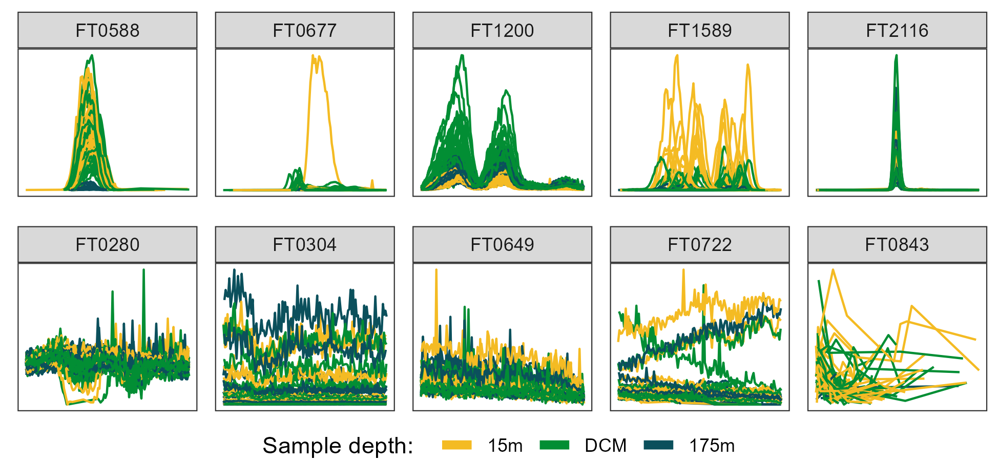

```{r setup, include=FALSE}
knitr::opts_chunk$set(echo = FALSE)
knitr::opts_knit$set(root.dir = '..')
options(readr.show_col_types = FALSE)
options(tidyverse.quiet = TRUE)
library(tidyverse)
library(RaMS)
```

```{r load data}
file_data <- read_csv("made_data_MS3000/file_data.csv") %>%
  mutate(depth=factor(depth, levels=c("15m", "DCM", "175m"))) %>%
  mutate(filename=basename(filename))
FT2040_features <- read_csv("made_data_FT2040/features_extracted.csv")
MS3000_features <- read_csv("made_data_MS3000/features_extracted.csv")
Pttime_features <- read_csv("made_data_Pttime/features_extracted.csv")
CultureData_features <- read_csv("made_data_CultureData/features_extracted.csv")
```

## Abstract

TBD

## Introduction

LC/MS techniques are neat

  - Fast sample processing
  - Low detection limits
  - Can characterize new molecules

Most of the data produced by them goes unused

  - Targeted workflows look at only a fraction of the data
  - Untargeted algorithms are still fairly new

Peakpicking is hard

  - Smooth transition from "good" into "meh" into "bad" across the limit of detection
  - Fundamental tradeoff between false positives and false negatives
  - Lots of false positive peaks because attempting to minimize false negative
  - Requires manual curation of peak quality which doesn't scale

Algorithms don't provide likelihood of "goodness"

  - Typical output: m/z, rt, area, maybe SN
  - We want/need a probability that this peak is just noise
  - Want to control the false positive/negative rate depending on project goals
  - We don't need new algorithms as much as we need a way to quantify success on the existing ones

Multiple advantages to a robust assessment of peak quality

  - Reduces manual labor in sorting out good peaks from bad
  - Improves statistical power
    - Reduces the number of hypotheses tested for univariate analyses
    - Increases relative power of significant peaks for multivariate analyses
  - Allows optimization of peakpicking parameters for untargeted approaches
  - "Good" peaks should be independent of software choices while noise is noisy
  - Enables more consistent quality control across labs
  - Focuses calculation time/energy on best peaks rather than all equally
  - Provides consistent, reproducible results via scripting instead of independent expert assessment

A single comprehensive quality parameter is more useful than many independent ones

  - Enables sensible threshold selection (50% likely to be a peak)
    - Rather than current arbitrary approaches (SNR > 20, peak height > 10e7)
  - Single metric has multivariate advantage over multiple univariate thresholds
    - Good peak can fall be weak in one or two metrics and still be safe
  - Relative power of different metrics has never been computed/compared
    - More important to have an isotope? Large area? Good shape? Differ between treatments?

Can be used to check improvements in peakpicking/chromatography

  - Traditional method: a few random peaks are checked after making a change to params
  - Total number of peaks used as proxy, not total number of GOOD peaks
  - Did this change improve overall peak quality?
  - Currently impossible to optimize these for untargeted peakpicking


## Methods

### Sample collection

TBD

### Sample processing

TBD

### LC conditions

Get from Laura and MW

### MS conditions

Get from Laura and MW

### Peakpicking with XCMS

Fill from the peakpicking_and_prep script or the msnexp_filled object

### Manual inspection and classification
Gold standard: manual inspection by a human expert

  - Decision to view the entire feature rather than a single trace
    - 100x less work
    - More representative of typical MS efforts
  - Decision to color by treatments
  - Decision to drop missed scans entirely

```{r grab demo msdata, eval=!file.exists("manuscript/minEIC_df.csv")}
msdata <- readRDS("made_data_MS3000/msdata.rds")

set.seed(123)
chosen_feats <- MS3000_features %>%
  filter(feat_class%in%c("Good", "Bad")) %>%
  group_by(feat_class) %>%
  slice_sample(n=5) %>%
  arrange(feat_class) %>%
  mutate(feat_id=row_number())
minEIC_df <- pmap(chosen_feats, function(...){
  with(list(...), {
    msdata$EIC[mz%between%pmppm(mean_mz, ppm=5)] %>%
      filter(rt%between%(mean_rt/60+c(-1, 1))) %>%
      mutate(feature, feat_class, feat_id)
  })
}) %>% 
  bind_rows() %>%
  filter(str_detect(filename, "180821")) %>%
  left_join(file_data, by="filename") %>%
  filter(samp_type=="Smp")
write_csv(minEIC_df, "manuscript/minEIC_df.csv")
```

```{r fig:some good some bad features}
minEIC_df <- read_csv("manuscript/minEIC_df.csv")

good_chroms_gp <- minEIC_df %>%
  filter(feat_class=="Good") %>%
  ggplot() +
  geom_line(aes(x=rt, y=int, group=filename, color=depth)) +
  facet_wrap(~feature, nrow = 1, scales = "free") +
  scale_color_manual(breaks = c("15m", "DCM", "175m"), values = c("#f4bb23", "#028e34", "#0b505c")) +
  theme_bw() +
  theme(axis.text = element_blank(),
        axis.ticks = element_blank(),
        axis.title = element_blank(),
        legend.position = "none", 
        panel.grid = element_blank()) +
  guides(color=guide_legend(override.aes = list(linewidth=2), title = "Sample depth:  "))
bad_chroms_gp <- minEIC_df %>%
  filter(feat_class=="Bad") %>%
  ggplot() +
  geom_line(aes(x=rt, y=int, group=filename, color=depth)) +
  facet_wrap(~feature, nrow = 1, scales = "free") +
  scale_color_manual(breaks = c("15m", "DCM", "175m"), values = c("#f4bb23", "#028e34", "#0b505c")) +
  theme_bw() +
  theme(axis.text = element_blank(),
        axis.ticks = element_blank(),
        axis.title = element_blank(),
        legend.position = "none",
        panel.grid = element_blank())
chroms_legend <- cowplot::get_legend(good_chroms_gp + theme(legend.position = "bottom"))

comb_cowplot <- cowplot::plot_grid(good_chroms_gp, bad_chroms_gp, chroms_legend, 
                                   ncol = 1, rel_heights = c(1, 1, 0.15))
ggsave(plot = comb_cowplot, 
       filename = "somegood_somebad_depthcolor_chroms.png", 
       device = "png", path = "manuscript/figures",
       width = 6.5, height = 3, units = "in", dpi = 300)
```

{width=70%}

### Feature extraction
Feature extraction - many possible metrics, calculated across features

  - Some trivial to calculate
    - Mean m/z, mean RT, number found
  - Some require access to the raw data
    - Peak shape, peak SNR, isotope existence, number of missed scans

```{r how are raw peak shape metrics calculated}
minEIC_df <- read_csv("manuscript/minEIC_df.csv")

single_EIC <- minEIC_df %>%
  filter(feature%in%c("FT0588", "FT0280")) %>%
  filter(filename=="180821_Smp_MS10C215m_A.mzML")

maybe_skews <- c(2.5, 3, 4, 5)
skew_names <- c("Large skew", "Small skew", "Minimal skew", "Zero skew")
names(maybe_skews) <- skew_names
perf_peak_data <- single_EIC %>%
  group_by(feature) %>%
  select(feature, rt, int) %>%
  mutate(rt=(rt-min(rt))/(max(rt)-min(rt))) %>%
  mutate(int=(int-min(int))/(max(int)-min(int))) %>%
  cbind(sapply(maybe_skews, function(x){
    perf_peak <- dbeta(.$rt, shape1=x, shape2=5)
    perf_peak/max(perf_peak)
  })) %>%
  rename(`Raw data`="int") %>%
  mutate(feature=factor(feature, levels=c("FT0588", "FT0280"), 
                        labels=c("Good peak", "Bad peak")))
summary_stats <- perf_peak_data %>%
  pivot_longer(-c(feature, rt, `Raw data`)) %>%
  mutate(new_val=value-`Raw data`) %>%
  group_by(feature, name) %>%
  summarise(single_cor=round(cor(`Raw data`, value), 2), 
            single_sd=round(sd(new_val), 2), 
            .groups = "drop_last") %>%
  mutate(name=factor(name, levels=skew_names)) %>%
  mutate(x_coord=c(0.125+(as.numeric(name)-1)/4))

peak_gp <- perf_peak_data %>%
  pivot_longer(-c(rt, feature)) %>%
  mutate(name=factor(name, levels=c("Raw data", skew_names))) %>%
  ggplot() +
  geom_line(aes(x=rt, y=value, color=name), lwd=1) +
  geom_rect(xmin=-Inf, xmax=Inf, ymax=-Inf, ymin=-.05, fill="white", color="grey90") +
  annotate("text", x=0.5, y=-Inf, vjust=-2, label="Pearson's r:") +
  facet_wrap(~feature) +
  geom_text(aes(x=x_coord, y=-Inf, label=single_cor, color=name),
             data = summary_stats, vjust=-.5, show.legend = FALSE) +
  scale_color_manual(breaks = c("Raw data", skew_names),
                     values = c("black", viridisLite::plasma(6)[2:5])) +
  scale_y_continuous(limits = c(-0.3, 1), breaks = c(0, 0.5, 1.0)) +
  labs(y="Normalized intensity", color=NULL) +
  theme_bw() +
  theme(axis.text.x = element_blank(),
        axis.title.x = element_blank(),
        axis.ticks.x = element_blank(),
        # strip.background = element_rect(fill="white"),
        legend.position="none",
        strip.text = element_text(size = 11))
residuals_gp <- perf_peak_data %>%
  pivot_longer(-c(rt, feature, `Raw data`)) %>%
  mutate(new_val=value-`Raw data`) %>%
  ggplot() +
  geom_rect(xmin=-Inf, xmax=Inf, ymax=Inf, ymin=0.85, fill="white", color="grey90") +
  geom_hline(yintercept = 0, lwd=1) +
  geom_line(aes(x=rt, y=new_val, color=name), lwd=1) +
  geom_text(aes(x=x_coord, y=Inf, label=single_sd, color=name),
             data = summary_stats, vjust=3) +
  annotate("text", x=0.5, y=Inf, vjust=1.5, label="Residual SD:") +
  facet_grid(~feature) +
  scale_color_manual(breaks = c("Raw data", skew_names),
                     values = c("black", viridisLite::plasma(6)[2:5])) +
  scale_y_continuous(breaks = c(-1, 0, 1), limits = c(-1.1, 1.3)) +
  labs(x="Normalized retention time", y="Residuals", color=NULL) +
  theme_bw() +
  theme(strip.background = element_blank(),
        strip.text = element_blank(),
        legend.position = "none")

fig_legend <- cowplot::get_legend(peak_gp + theme(legend.position="right") + 
                                    guides(color=guide_legend(override.aes = list(lwd=2)), text="none"))

comb_cowplot <- egg::ggarrange(peak_gp, residuals_gp, ncol = 1, draw = FALSE)

comb_peakmetrics_gp <- cowplot::plot_grid(
  comb_cowplot, fig_legend, rel_widths = c(1, 0.25)
) + theme(plot.background = element_rect(fill = "white", color=NA))

ggsave(plot = comb_peakmetrics_gp, 
       filename = "peakmetrics_singlechrom.png", 
       device = "png", path = "manuscript/figures",
       width = 6.5, height = 4, units = "in", dpi = 300)
```

![Figure 2: Method used to calculate the metrics for the two-parameter model from the raw data via comparison to an idealized pseudo-Gaussian peak for both manually identified "Good" and "Bad" peaks. Normalization was performed by linearly scaling the raw values into the 0-1 range by subtracting the minimum value and dividing by the maximum. Peak shape similarity was measured with Pearson's correlation coefficient and the noise level is estimated as the standard deviation of the residuals after the raw data is subtracted from the idealized peak.](figures/peakmetrics_singlechrom.png){width=70%}

## Results

Data description

  - Counts of MFs in each manually-assigned category
  - Proportion of good/bad in each dataset
  - Supplemental figure: class colored histograms with each metric?
  - Supplemental figure: class colored pairs plot?

Logistic regressions

  - Predictions are strongly binomial for all and xcms, less so for two-parameter model
    - Discuss why we dropped the p-value metric?
  - Performance within a given dataset vs across datasets and model selection
    - Introduce FDR and GPF metrics
      - Motivated by actual questions
      - FDR = 1-precision (what fraction are likely false?)
      - GPF = recall/sensitivity (what percent did I recover?)
    - Very low FDR (5-10%) and high GPF (75-90%) *within* datasets for all metrics and xcms metrics, worse for raw data (~20% FDR, ~75% GPF)
    - Higher FDR and GPF *across* datasets for all and xcms, about the same for raw data, leaves them all performing about the same(!)
    - Figure 4
    - Overfitting concerns (line slope) on cross-dataset
    - Step-down methodology and independence from training set (Figure 5)
  - Model stability
    - How similar are the model parameters to each other when trained on Falkor/MESO/both?
      - Supplemental figure: 3x errorbar plots for Falkor/MESO/both model estimates +/- SEs
    - What fraction of the dataset did we actually need to label? (Answer: basically the whole thing, possibly even more)
      - Supplemental figure: subset-based training with individual dots for min (maybe full?) model estimates added to full model estimates +/- SE bars
  - Threshold selection and FDR in CultureData/Pttime (Figure 6)
    - Higher threshold more representative of real research/applications in situations where 50% chance of being a peak is too high
    - Additional external validation for FDR that still shows increase, albeit small (0-1% -> 2-5%)
    - Unable to check GPF without fully labelling the datasets

Other ML strategies

  - Comparison to RF things
  - Comparison to glmnet things


Biological implications

  - Clockplot and univariate statistics
    - Report proportions of MFs in each category?
    - Big central thing where all the noise ended up
    - Many "bad" still have strong biology trend, not a sufficient measure on its own
    - Missing out on some good peaks (far left clockplot)
    - Do the FDR corrected p-value comparisons with more/less peaks by threshold
  - PERMANOVA table
    - Better performance somehow with 90% threshold than manually labeled "good" peaks?
    - Emphasize the lack of power when all peaks are included in the analysis with 1% and 0% thresholds
  - Actual biology things
    - Most metabolites track with biomass
    - Surface-specific largely MAAs, some new?
    - Degradation products or bacterial things accumulating at depth?


### Predicted probability distributions

```{r colored histograms on all 4 datasets}
# Train on MESOSCOPE/Falkor combined model
# Raw data metrics only
# Color by feature class
both_min_model <- rbind(FT2040_features, MS3000_features) %>%
  select(feat_class, med_cor, med_SNR) %>%
  filter(feat_class%in%c("Good", "Bad")) %>%
  mutate(feat_class=feat_class=="Good") %>%
  glm(formula=feat_class~., family = binomial)
pred_prob_class_color_hists_df <- bind_rows(lst(
  Falkor=FT2040_features, MESOSCOPE=MS3000_features,
  CultureData=CultureData_features, Pttime=Pttime_features), 
  .id = "dataset") %>%
  mutate(pred_prob=predict(object=both_min_model,newdata = ., type = "response")) %>%
  mutate(pred_class=ifelse(pred_prob>0.9, "Good", "Bad")) %>%
  mutate(error_type=case_when(
    feat_class=="Good" & pred_class=="Good" ~ "%TP",
    feat_class=="Good" & pred_class=="Bad" ~ "%FN",
    feat_class=="Bad" & pred_class=="Good" ~ "%FP",
    feat_class=="Bad" & pred_class=="Bad" ~ "%TN",
    TRUE ~ "Incomparable"
  )) %>%
  mutate(dataset=factor(dataset, levels=c("MESOSCOPE", "Falkor", "CultureData", "Pttime")))

pred_prob_class_color_hists_gp <- ggplot(pred_prob_class_color_hists_df) +
  geom_histogram(aes(x=pred_prob, fill=feat_class), breaks=seq(0, 1, 0.02)) +
  facet_wrap(~dataset, ncol = 1, scales="free_y") +
  coord_cartesian(ylim = c(0, 200)) +
  geom_vline(xintercept = 0.9, color="black", linewidth=1) +
  scale_fill_manual(breaks = c("Good", "Bad", "Meh", "Stans only", "Unclassified"),
                    values = c("#f4bb23", "#a41118", "#0b505c", "#028e34", "grey50")) +
  labs(x="Predicted probability", y="# of mass features", fill="Manual\nclassification") +
  ggtitle("Still need to figure out y-axis breaking")
ggsave(plot = pred_prob_class_color_hists_gp, 
       filename = "pred_prob_class_color_hists.png", 
       device = "png", path = "manuscript/figures",
       width = 6.5, height = 3, units = "in", dpi = 300)

# Manual facetting with egg and cowplot
base_gp <- ggplot() +
  aes(x=pred_prob, fill=feat_class) +
  facet_wrap(~dataset, scales="free_y") +
  scale_fill_manual(breaks = c("Good", "Bad", "Meh", "Stans only", "Unclassified"),
                    values = c("#f4bb23", "#a41118", "#0b505c", "#028e34", "grey50")) +
  labs(x="Predicted probability", y="# of mass features", fill="Manual\nclassification") +
  theme_bw() +
  theme(axis.text.y.right = element_blank(),
        axis.ticks.y.right = element_blank(),
        legend.position = "none")
axis_breaks <- pred_prob_class_color_hists_df %>%
  group_by(dataset) %>%
  mutate(pred_prob=cut(pred_prob, breaks=seq(0, 1, 0.02))) %>%
  count(pred_prob) %>%
  slice(1) %>%
  pull(n, dataset)
falk_hist_gp <- base_gp + 
  geom_histogram(breaks=seq(0, 1, 0.02), data = pred_prob_class_color_hists_df %>% 
                   filter(dataset=="Falkor")) +
  scale_y_continuous(breaks = c(0, 50, 100, 150, 195),
                     labels = c(0, 50, 100, 150, axis_breaks["Falkor"])) +
  geom_vline(xintercept = 0.9, color="black", linewidth=1) +
  annotate("rect", xmin=0, xmax=1, ymin=180, ymax=185, fill="white", color="black") +
  annotate("rect", xmin=0, xmax=0.125, ymin=195, ymax=Inf, fill="white", color="grey90") +
  coord_cartesian(ylim = c(0, 200), expand = FALSE) +
  theme(axis.title.x = element_blank(), axis.text.x = element_blank())
meso_hist_gp <- base_gp + 
  geom_histogram(breaks=seq(0, 1, 0.02), data = pred_prob_class_color_hists_df %>% 
                   filter(dataset=="MESOSCOPE")) +
  scale_y_continuous(breaks = c(0, 50, 100, 150, 200, 240),
                     labels = c(0, 50, 100, 150, 200, axis_breaks["MESOSCOPE"])) +
  geom_vline(xintercept = 0.9, color="black", linewidth=1) +
  annotate("rect", xmin=0, xmax=1, ymin=220, ymax=230, fill="white", color="black") +
  annotate("rect", xmin=0, xmax=0.125, ymin=240, ymax=Inf, fill="white", color="grey90") +
  coord_cartesian(ylim = c(0, 250), expand = FALSE) +
  theme(axis.title = element_blank(), axis.text.x = element_blank())
culture_hist_gp <- base_gp + 
  geom_histogram(breaks=seq(0, 1, 0.02), data = pred_prob_class_color_hists_df %>% 
                   filter(dataset=="CultureData")) +
  scale_y_continuous(breaks = c(0, 50, 100, 116),
                     labels = c(0, 50, 100, axis_breaks["CultureData"])) +
  geom_vline(xintercept = 0.9, color="black", linewidth=1) +
  annotate("rect", xmin=0, xmax=1, ymin=110, ymax=113, fill="white", color="black") +
  annotate("rect", xmin=0, xmax=0.125, ymin=116, ymax=Inf, fill="white", color="grey90") +
  coord_cartesian(ylim = c(0, 120), expand = FALSE)
pttime_hist_gp <- base_gp + 
  geom_histogram(breaks=seq(0, 1, 0.02), data = pred_prob_class_color_hists_df %>% 
                   filter(dataset=="Pttime")) +
  scale_y_continuous(breaks = c(0,100,200,300,400,510),
                     labels = c(0,100,200,300,400,axis_breaks["Pttime"])) +
  geom_vline(xintercept = 0.9, color="black", linewidth=1) +
  annotate("rect", xmin=0, xmax=1, ymin=470, ymax=485, fill="white", color="black") +
  annotate("rect", xmin=0, xmax=0.125, ymin=510, ymax=Inf, fill="white", color="grey90") +
  coord_cartesian(ylim = c(0, 520), expand = FALSE) +
  theme(axis.title.y = element_blank())
egg_grob <- egg::ggarrange(falk_hist_gp, meso_hist_gp, culture_hist_gp, pttime_hist_gp, draw = FALSE)
egg_legend <- cowplot::get_legend(culture_hist_gp + theme(legend.position = "right"))
egg_complete <- cowplot::plot_grid(egg_grob, egg_legend, rel_widths = c(1, 0.25)) +
  theme(plot.background = element_rect(fill = "white", color=NA))
ggsave(plot = egg_complete, 
       filename = "manuscript/figures/pred_prob_class_color_hists.png", 
       device = "png",
       width = 6.5, height = 4, units = "in", dpi = 300)
```

![Figure 3: Histograms showing the estimated likelihood of a given mass feature being categorized as "Good" according to the two-parameter logistic model trained on the combined fully-labeled Falkor and MESOSCOPE datasets. Colors indicate the category in which each feature was manually assigned by an expert, with "Stans only" referring to a good peak that was only visible in the standards run alongside the samples. Datasets CultureData and Pttime were manually labeled only for those features with an estimated likelihood above 90% (black vertical line) and were otherwise unclassified.](figures/pred_prob_class_color_hists.png){width=70%}

Explain what the different datasets are?

Make sure the break gap is consistent

Maybe turn into two rows, one zoomed and one unzoomed?

Differentiate the 0.9 line from the axis break line - don't like the vertical black line, looks like data

Convert "meh" to "ambiguous"

### Model cross-validation with novel datasets

```{r FDR vs GPF cross-train triangle figure feature selection}
# Dark/light green/blue triangle plot
# Include best-fit lines for easier slope comparison
# but don't extend beyond data
dataset_versions <- c("FT2040_features", "MS3000_features")

raw_data_params <- c("med_cor", "med_SNR")
xcms_params <- c("mean_mz", "sd_ppm", "mean_rt", "sd_rt", "mean_pw", 
                 "sd_pw", "log_mean_area", "log_sd_area", "sn", 
                 "f", "scale", "lmin", "feat_npeaks", "n_found", 
                 "samps_found", "stans_found")
all_params <- c("mean_mz", "sd_ppm", "mean_rt", "sd_rt", "mean_pw", "sd_pw",
                "log_mean_area", "log_sd_area", "sn", "f", "scale", 
                "lmin", "feat_npeaks", "n_found", "samps_found", "stans_found", 
                "med_cor", "med_SNR", "med_missed_scans", "smp_to_blk", 
                "smp_to_std", "shape_cor", "area_cor", "feat_class")

fdr_gpf_cross_train_df <- lst(all_params, raw_data_params, xcms_params) %>%
  imap(function(param_selection, param_name){
    lapply(dataset_versions, function(train_set){
      full_model <- get(train_set) %>% 
        filter(feat_class%in%c("Good", "Bad")) %>%
        select(feat_class, all_of(param_selection)) %>%
        mutate(feat_class=feat_class=="Good") %>%
        glm(formula=feat_class~., family = binomial)
      lapply(dataset_versions, function(test_set){
        get(test_set) %>%
          mutate(pred_prob=predict(object=full_model,newdata = ., type = "response")) %>%
          mutate(pred_class=ifelse(pred_prob>0.5, "Good", "Bad")) %>%
          select(feat_class, starts_with("pred_class")) %>%
          mutate(train_test=paste(train_set, test_set, sep = "-")) %>%
          mutate(train_test=str_remove_all(train_test, "_features")) %>%
          mutate(cross_type=ifelse(train_set==test_set, "Same", "Different"))
      }) %>% bind_rows()
    }) %>% bind_rows() %>% mutate(which_params=param_name)
  }) %>% bind_rows() %>%
  mutate(error_type=case_when(
    feat_class=="Bad" & pred_class=="Bad" ~ "TN",
    feat_class=="Bad" & pred_class=="Good" ~ "FP",
    feat_class=="Good" & pred_class=="Bad" ~ "FN",
    feat_class=="Good" & pred_class=="Good" ~ "TP"
  )) %>%
  group_by(train_test, which_params, cross_type) %>%
  count(error_type) %>%
  ungroup() %>%
  mutate(cross_type=factor(cross_type, levels=c("Same", "Different"))) %>%
  pivot_wider(names_from=error_type, values_from = n) %>%
  mutate(FDR=FP/(FP+TP)) %>%
  mutate(GPF=TP/(FN+TP)) %>%
  pivot_longer(c(FDR, GPF)) %>%
  mutate(name=paste0("%", name)) %>%
  mutate(which_params=factor(which_params, 
                             labels=c("All metrics", "XCMS metrics", "Raw data metrics"),
                             levels=c("all_params", "xcms_params", "raw_data_params"))) %>%
  mutate(cross_type_num=as.numeric(cross_type))

train_test_levels <- c("MS3000-MS3000", "FT2040-FT2040", "MS3000-FT2040", "FT2040-MS3000")
train_test_labels <- c("MESO-MESO", "Falkor-Falkor", "MESO-Falkor", "Falkor-MESO")
fdr_gpf_cross_train_gp <- fdr_gpf_cross_train_df %>%
  mutate(train_test=factor(train_test, levels=train_test_levels, labels=train_test_labels)) %>%
  mutate(name=factor(name, levels=c("%GPF", "%FDR"), labels=c("GPF", "FDR"))) %>%
  ggplot() +
  geom_point(aes(x=cross_type, y=value, color=train_test, 
                 fill=train_test, shape=name), size=5) +
  geom_smooth(aes(x=cross_type_num, y=value, group=name), 
              method = "lm", formula="y~x", color="black", se=FALSE) +
  facet_grid(~which_params) +
  scale_x_discrete(labels = c("Same\ndataset\n", "Different\ndataset\n"),
                   breaks = c("Same", "Different")) +
  scale_color_manual(values = c("#0b505c", "#184d1f", "#0d8299", "#028e34"), 
                     breaks = train_test_labels,
                     aesthetics = c("color", "fill")) +
  scale_shape_manual(breaks = c("GPF", "FDR"), values = c("\u25B2", "\u25BC")) +
  coord_cartesian(ylim = c(0, 1)) +
  scale_y_continuous(labels = scales::label_percent()) +
  theme_bw() +
  theme() +
  labs(x=NULL, y=NULL, color="Train-test", fill="Train-test", shape="Error type") +
  guides(shape=guide_legend(order=1))

ggsave(plot = fdr_gpf_cross_train_gp, 
       filename = "fdr_gpf_cross_train.png", 
       device = "png", path = "manuscript/figures",
       width = 6.5, height = 3, units = "in", dpi = 300)
```

![Figure 4: False discovery rate (%FDR) and fraction of good peaks found (GPF) plotted across different subsets of model parameters. Lower %FDR indicates a smaller fraction of false positives among those peaks the model categorized as "Good" using a threshold of 0.5, and higher %GPF indicates a larger fraction of the total good peaks were found using the same threshold. Points are colored by the model used for training and testing, with internal validation (using the same dataset for training as prediction) in the darker colors on the left and external validation (using a different dataset for training than prediction) in the lighter colors on the right of each panel. Lines of best fit have been estimated and plotted in black on top of the data points.](figures/fdr_gpf_cross_train.png){width=70%}

Dark blue and dark green are too similar, need to separate these better somehow. 

Include conclusions in figure legend? Something like "slope of the line is much greater in All metrics and XCMS metrics, indicating overfitting"?

Is averaging the two points for the best fit line best? Lines sometimes have different slopes

Is GPF worth using instead of more common jargon like 1-precision

Maybe simpler metric

Line feels a little heavy and too dark, put behind data, maybe make line grey instead of dark black

### Full model probability depends strongly on training data, two-parameter model does not

```{r red/gold rank dotplot step-down method}
dataset_versions <- c("FT2040_features", "MS3000_features")
raw_data_params <- c("med_cor", "med_SNR")
xcms_params <- c("mean_mz", "sd_ppm", "mean_rt", "sd_rt", "mean_pw", 
                 "sd_pw", "log_mean_area", "log_sd_area", "sn", 
                 "f", "scale", "lmin", "feat_npeaks", "n_found", 
                 "samps_found", "stans_found")
all_params <- c("mean_mz", "sd_ppm", "mean_rt", "sd_rt", "mean_pw", "sd_pw",
                "log_mean_area", "log_sd_area", "sn", "f", "scale", 
                "lmin", "feat_npeaks", "n_found", "samps_found", "stans_found", 
                "med_cor", "med_SNR", "med_missed_scans", "smp_to_blk", 
                "smp_to_std", "shape_cor", "area_cor", "feat_class")
dotplot_stepdown_data <- lst(all_params, xcms_params, raw_data_params) %>%
  imap(function(param_selection, param_name){
    lapply(dataset_versions, function(train_set){
      model_i <- get(train_set) %>% 
        filter(feat_class%in%c("Good", "Bad")) %>%
        select(feat_class, all_of(param_selection)) %>%
        mutate(feat_class=feat_class=="Good") %>%
        glm(formula=feat_class~., family = binomial)
      MS3000_features %>%
        mutate(pred_prob=predict(model_i, ., type="response")) %>%
        select(feature, feat_class, pred_prob) %>%
        mutate(which_params=param_name) %>%
        mutate(training_set=train_set)
    }) %>% bind_rows()
  }) %>% bind_rows()

raw_prob_space_gp <- dotplot_stepdown_data %>%
  pivot_wider(names_from = training_set, values_from = pred_prob) %>%
  filter(feat_class%in%c("Good", "Bad")) %>%
  mutate(which_params=factor(which_params, 
                             levels=c("all_params", "xcms_params", "raw_data_params"),
                             labels=c("All metrics", "XCMS metrics", "Raw data metrics"))) %>%
  ggplot() +
  geom_abline(slope = 1, intercept = 0, color="black", lwd=1) +
  geom_point(aes(x=FT2040_features, y=MS3000_features, color=feat_class), alpha=0.2) +
  facet_wrap(~which_params, nrow = 1) +
  scale_fill_manual(values = c("#a41118", "#f4bb23"), breaks = c("Bad", "Good"), 
                    aesthetics = c("color", "fill")) +
  scale_x_continuous(breaks = c(0, 0.5, 1)) +
  scale_y_continuous(breaks = c(0, 0.5, 1)) +
  coord_fixed() +
  labs(x="Falkor-trained model (predicted probability)", 
       y="MESO-trained model\n(predicted probability)") +
  theme_bw() +
  theme(legend.position = "none",
        strip.background = element_rect(fill="white"))
rank_prob_space_gp <- dotplot_stepdown_data %>%
  group_by(training_set, which_params) %>%
  mutate(pred_prob=rank(pred_prob)) %>%
  pivot_wider(names_from = training_set, values_from = pred_prob) %>%
  mutate(which_params=factor(which_params, 
                             levels=c("all_params", "xcms_params", "raw_data_params"),
                             labels=c("All metrics", "XCMS metrics", "Raw data metrics"))) %>%
  filter(feat_class%in%c("Good", "Bad")) %>%
  ggplot() +
  geom_abline(slope = 1, intercept = 0, color="black", lwd=1) +
  geom_point(aes(x=FT2040_features, y=MS3000_features, color=feat_class), alpha=0.2) +
  facet_wrap(~which_params, nrow = 1) +
  scale_fill_manual(values = c("#a41118", "#f4bb23"), breaks = c("Bad", "Good"), 
                    aesthetics = c("color", "fill")) +
  scale_x_continuous(breaks = c(0, nrow(MS3000_features)), 
                     labels = c("Min rank", "Max rank")) +
  scale_y_continuous(breaks = c(0, nrow(MS3000_features)),
                     labels = c("Min\nrank", "Max\nrank")) +
  labs(x="Falkor-trained model (ranked likelihood)", 
       y="MESO-trained model\n(ranked likelihood)",
       color=NULL) +
  guides(color=guide_legend(override.aes = list(size=4, alpha=0.8))) +
  coord_fixed() +
  theme_bw() +
  theme(axis.text.x = ggtext::element_markdown(hjust=c(0, 1)),
        # strip.text = element_blank(),
        strip.background = element_rect(fill="white"),
        legend.position=c(0.875, 0.25),
        legend.background = element_blank(),
        legend.spacing.x = unit(0.003, units = "npc"))
comb_prob_space_gp <- egg::ggarrange(raw_prob_space_gp, rank_prob_space_gp, draw = FALSE)
ggsave(plot = comb_prob_space_gp, 
       filename = "comb_prob_space.png", 
       device = "png", path = "manuscript/figures",
       width = 6.5, height = 5, units = "in", dpi = 300)
```

{width=70%}

Make sure labels are the same as above - probably stick with XCMS for specificity. (Could just go in tables?)

Remember to add Pearson and Spearman correlation coefficients in the corners!

Maybe avoid "rank" phrasing? Instead of best/worst?

### Error rates on novel data with stricter likelihood threshold

```{r FDR vs GPF with additional datasets}
# Currently a fairly simple figure, may need additional data?
both_min_model <- rbind(FT2040_features, MS3000_features) %>%
  select(feat_class, med_cor, med_SNR) %>%
  filter(feat_class%in%c("Good", "Bad")) %>%
  mutate(feat_class=feat_class=="Good") %>%
  glm(formula=feat_class~., family = binomial)
pred_probs_all <- bind_rows(lst(
  Falkor=FT2040_features, MESOSCOPE=MS3000_features,
  CultureData=CultureData_features, Pttime=Pttime_features), 
  .id = "dataset") %>%
  mutate(pred_prob=predict(object=both_min_model,newdata = ., type = "response")) %>%
  mutate(pred_class=ifelse(pred_prob>0.9, "Good", "Bad")) %>%
  mutate(error_type=case_when(
    feat_class=="Good" & pred_class=="Good" ~ "%TP",
    feat_class=="Good" & pred_class=="Bad" ~ "%FN",
    feat_class=="Bad" & pred_class=="Good" ~ "%FP",
    feat_class=="Bad" & pred_class=="Bad" ~ "%TN",
    TRUE ~ "Incomparable"
  )) %>%
  mutate(dataset=factor(dataset, levels=c("MESOSCOPE", "Falkor", "CultureData", "Pttime"))) %>%
  filter(error_type!="Incomparable") %>%
  group_by(dataset, error_type) %>%
  summarise(n=n(), .groups = 'drop') %>%
  complete(dataset, error_type, fill=list(n=0))
error_type_all_datasets <- pred_probs_all %>%
  pivot_wider(names_from=error_type, values_from = n) %>%
  mutate(`FDR`=`%FP`/(`%FP`+`%TP`)) %>%
  mutate(`GPF`=`%TP`/(`%FN`+`%TP`)) %>%
  mutate(`GPF`=ifelse(dataset%in%c("CultureData", "Pttime"), NA, `GPF`)) %>%
  pivot_longer(c(`FDR`, `GPF`)) %>%
  drop_na()

fdr_gpf_all_datasets_gp <- error_type_all_datasets %>%
    mutate(desc=case_when(
    is.na(value) ~ NA,
    name=="FDR"~ paste0("frac(",`%FP`,",",`%FP`+`%TP`,")"),
    name=="GPF"~ paste0("frac(",`%TP`,",",`%FN`+`%TP`,")")
  )) %>%
  mutate(vjust_custom=case_when(
    is.na(value) ~ NA,
    name=="FDR" & dataset=="Pttime" ~ 1.3,
    name=="FDR" ~ -0.3,
    name=="GPF" ~ 1.3,
  )) %>%
  mutate(name=factor(name, levels=c("GPF", "FDR"),
                     labels=c("Fraction of good peaks found (GPF)", 
                              "False discovery rate (FDR)"))) %>%
  mutate(dataset=factor(dataset, 
                        levels = c("Falkor", "MESOSCOPE", "CultureData", "Pttime"),
                        labels= c("Falkor", "MESO-\nSCOPE", "Culture\nData", "Pttime"))) %>%
  ggplot(aes(x=dataset, y=value)) +
  geom_point(size=3) +
  geom_text(aes(label=desc, vjust=vjust_custom), parse=TRUE) +
  facet_wrap(~name, scales = "free_y", ncol = 1) +
  scale_y_continuous(limits = c(0, NA), labels = scales::label_percent()) +
  theme_bw() +
  theme(axis.title = element_blank(),
        strip.background = element_rect(fill="white"))

ggsave(plot = fdr_gpf_all_datasets_gp, 
       filename = "fdr_gpf_all_datasets.png", 
       device = "png", path = "manuscript/figures",
       width = 3, height = 4, units = "in", dpi = 300)

# Confusion matrices for confirmation
# pred_probs_all
# pred_probs_all %>%
#   ggplot(aes(x=error_type, y=n)) +
#   geom_col(color="#0b505c", fill="#0b505c") +
#   geom_text(aes(label=n), vjust=-0.2, color="#0b505c") +
#   facet_wrap(~dataset, nrow=1) +
#   theme_bw() +
#   theme(axis.title = element_blank())
```

![Figure 6: False discovery rate and proportion of total good peaks identified as good by the two-parameter model trained on the combined MESOSCOPE/Falkor dataset and applied to each dataset individually with a threshold of 0.9. FDR is calculated by dividing the number of false positives by the total positives produced by the model and GPF is calculated by dividing the number of true positives by the total number of good peaks as identified manually. Points correspond to the calculated percentage and absolute numbers are provided above/below the point.](figures/fdr_gpf_all_datasets.png){width=30%}

Emphasize the use of a different threshold here!

Explain why there are no values for GPF in Pttime/CultureData?

Render as a table and see how that looks instead?

Include Pttime definition in the figure caption?

Maybe include the facet captions as the y-axis label instead? Anitra doesn't love how it looks as-is


### Implications for biological conclusions

```{r clockplot BMIS, eval=!file.exists("manuscript/MS3000_norm_areas.csv")}
source("manuscript/BMIS_peakprep.R")
```

```{r clockplot dataset munging, eval=!file.exists("manuscript/MS3000_clockplot_coords.csv")}
norm_area_data <- read_csv("manuscript/MS3000_norm_areas.csv")

both_min_model <- rbind(FT2040_features, MS3000_features) %>%
  select(feat_class, med_cor, med_SNR) %>%
  filter(feat_class%in%c("Good", "Bad")) %>%
  mutate(feat_class=feat_class=="Good") %>%
  glm(formula=feat_class~., family = binomial)
best_feats <- MS3000_features %>%
  filter(feat_class%in%c("Good", "Bad")) %>%
  mutate(pred_prob=predict(object=both_min_model,newdata = ., type = "response")) %>%
  mutate(pred_class=ifelse(pred_prob>0.5, "Good", "Bad")) %>%
  select(feature, feat_class, pred_class)
clockplot_data <- norm_area_data %>%
  right_join(best_feats, by = join_by(feature)) %>%
  left_join(file_data %>% select(filename, depth), by = join_by(filename))

kw_pvals_all <- clockplot_data %>%
  nest(data=-c(feature, pred_class)) %>%
  mutate(tidyaov=map(
    data, ~ broom::tidy(kruskal.test(.x$norm_area~.x$depth)))
  ) %>%
  unnest(tidyaov) %>%
  select(-parameter, -method) %>%
  mutate(cor_pval_all=p.adjust(p.value, method="fdr")) %>%
  group_by(pred_class) %>%
  mutate(cor_pval_byclass=p.adjust(p.value, method="fdr")) %>%
  ungroup() %>%
  select(feature, cor_pval_byclass)
resp_class_levels <- c("All equal", 
    "15m > DCM = 175m", "15m > DCM > 175m", "15m = DCM > 175m",
    "DCM > 15m > 175m", "DCM > 15m = 175m", "DCM > 175m > 15m", 
    "15m < DCM = 175m", "15m < DCM < 175m", "15m = DCM < 175m", 
    "DCM < 15m < 175m", "DCM < 15m = 175m", "DCM < 175m < 15m", 
    "Hard to tell")
kw_classes_all <- clockplot_data %>%
  group_by(feature) %>%
  mutate(norm_area=rank(norm_area)) %>%
  filter(var(norm_area)>0) %>%
  rstatix::dunn_test(norm_area~depth, p.adjust.method = "none") %>%
  mutate(contrast=paste(group2, group1, sep = "_")) %>%
  select(feature, contrast, est=statistic, pval=p.adj) %>%
  pivot_wider(names_from = contrast, values_from = c(pval, est)) %>%
  mutate(resp_class=case_when(
    pval_DCM_15m<0.05 & pval_175m_15m<0.05 & pval_175m_DCM<0.05 & est_DCM_15m<0 & est_175m_15m<0 & est_175m_DCM<0 ~ "15m > DCM > 175m",
    pval_DCM_15m<0.05 & pval_175m_15m<0.05 & pval_175m_DCM<0.05 & est_DCM_15m>0 & est_175m_15m<0 & est_175m_DCM<0 ~ "DCM > 15m > 175m",
    pval_DCM_15m<0.05 & pval_175m_15m<0.05 & pval_175m_DCM<0.05 & est_DCM_15m<0 & est_175m_15m>0 & est_175m_DCM>0 ~ "DCM < 15m < 175m",
    pval_DCM_15m<0.05 & pval_175m_15m<0.05 & pval_175m_DCM<0.05 & est_DCM_15m>0 & est_175m_15m>0 & est_175m_DCM>0 ~ "15m < DCM < 175m",
    pval_DCM_15m<0.05 & pval_175m_15m<0.05 & pval_175m_DCM<0.05 & est_DCM_15m>0 & est_175m_15m>0 & est_175m_DCM<0 ~ "DCM > 175m > 15m",
    pval_DCM_15m<0.05 & pval_175m_15m<0.05 & pval_175m_DCM<0.05 & est_DCM_15m<0 & est_175m_15m<0 & est_175m_DCM>0 ~ "DCM < 175m < 15m",
    pval_DCM_15m<0.05 & pval_175m_15m<0.05 & pval_175m_DCM>0.05 & est_DCM_15m<0 & est_175m_15m<0 ~ "15m > DCM = 175m",
    pval_DCM_15m<0.05 & pval_175m_15m<0.05 & pval_175m_DCM>0.05 & est_DCM_15m>0 & est_175m_15m>0 ~ "15m < DCM = 175m",
    pval_DCM_15m>0.05 & pval_175m_15m<0.05 & pval_175m_DCM<0.05 & est_175m_15m<0 & est_175m_DCM<0 ~ "15m = DCM > 175m",
    pval_DCM_15m>0.05 & pval_175m_15m<0.05 & pval_175m_DCM<0.05 & est_175m_15m>0 & est_175m_DCM>0 ~ "15m = DCM < 175m",
    pval_DCM_15m<0.05 & pval_175m_15m>0.05 & pval_175m_DCM<0.05 & est_DCM_15m>0 & est_175m_DCM<0 ~ "DCM > 15m = 175m",
    pval_DCM_15m<0.05 & pval_175m_15m>0.05 & pval_175m_DCM<0.05 & est_DCM_15m<0 & est_175m_DCM>0 ~ "DCM < 15m = 175m",
    pval_DCM_15m>0.05 & pval_175m_15m>0.05 & pval_175m_DCM>0.05 ~ "All equal",
    TRUE ~ "Hard to tell"
  )) %>%
  select(feature, resp_class) %>%
  mutate(resp_class=factor(resp_class, levels=resp_class_levels))

clockplot_xy_spots <- clockplot_data %>%
  group_by(feature) %>%
  mutate(norm_area=rank(norm_area)) %>%
  group_by(feature, depth) %>%
  summarise(mean_fold_change=mean(norm_area/50), .groups = "drop") %>% 
  # div by 50 bc 99 files and median 1:99 is 50
  pivot_wider(names_from=depth, values_from=mean_fold_change) %>%
  mutate(x=DCM-1) %>%           # cursed but works??
  mutate(y=`15m`+DCM/2-1.5) %>% # super fucking cursed
  select(feature, x, y)

clockplot_complete_df <- clockplot_data %>%
  distinct(feature, feat_class, pred_class) %>%
  left_join(clockplot_xy_spots, by = join_by(feature)) %>%
  left_join(kw_pvals_all, by = join_by(feature)) %>%
  left_join(kw_classes_all, by = join_by(feature)) %>%
  mutate(error_type=case_when(
    pred_class=="Good" & feat_class=="Good" ~ "TP",
    pred_class=="Good" & feat_class=="Bad" ~ "FP",
    pred_class=="Bad" & feat_class=="Good" ~ "FN",
    pred_class=="Bad" & feat_class=="Bad" ~ "TN"
  )) %>%
  mutate(error_type=factor(error_type, levels=c("TP", "FP", "FN", "TN"),
                           labels=c("Good peak found", "Bad peak included",
                                    "Good peak missed", "Bad peak avoided")))

write_csv(clockplot_complete_df, file = "manuscript/MS3000_clockplot_coords.csv")
```

```{r clockplot}
resp_class_levels <- c("All equal", 
    "15m > DCM = 175m", "15m > DCM > 175m", "15m = DCM > 175m",
    "DCM > 15m > 175m", "DCM > 15m = 175m", "DCM > 175m > 15m", 
    "15m < DCM = 175m", "15m < DCM < 175m", "15m = DCM < 175m", 
    "DCM < 15m < 175m", "DCM < 15m = 175m", "DCM < 175m < 15m", 
    "Hard to tell")
clockplot_complete_df <- read_csv(file = "manuscript/MS3000_clockplot_coords.csv") %>%
  mutate(resp_class=factor(resp_class, levels=resp_class_levels))

cmap_name <- "infinity"
cmap_url <- paste0("https://raw.githubusercontent.com/1313e/CMasher/master/",
                   "cmasher/colormaps/", cmap_name, "/", cmap_name, "_norm.txt")
cmtable <- read.table(cmap_url)
cmscale <- rgb(cmtable[,1], cmtable[,2], cmtable[,3])
color_scale <- c("grey50", head(cmscale[seq(1, length(cmscale), length.out=13)], 12), "grey80")
names(color_scale) <- resp_class_levels

clock_scale <- 0.66
axis_xends <- c(-1/2, 1.1, -1/2)*clock_scale
axis_yends <- c(sqrt(3)/2, 0, -sqrt(3)/2)*clock_scale
axis_y_dodge <- c(2, 2, -2)*clock_scale/25

clockplot_base_gp <- ggplot() +
  annotate("segment", x=c(0,0,0), y=c(0,0,0), 
           xend=axis_xends, yend=axis_yends,
           arrow=arrow(length=unit(0.02, "npc"), type = "closed")) +
  annotate("segment", x=c(0,0,0), y=c(0,0,0),
           xend=-axis_xends, yend=-axis_yends,
           lty = 2) +
  annotate("label", x=axis_xends, y=axis_yends+axis_y_dodge,
           label=c("15m axis", "DCM axis", "175m axis"), 
           fill="#FFFFFFAA", label.size=0) +
  coord_fixed(xlim = c(-0.65, 1.3)*clock_scale, 
              ylim = c(-1, 1)*clock_scale, 
              expand=TRUE) +
  scale_color_manual(values = color_scale, breaks = names(color_scale), drop=FALSE) +
  theme_void() +
  theme(legend.position = "right", 
        legend.title = element_blank(),
        plot.background = element_rect(fill="white", color="white")) +
  guides(colour = guide_legend(override.aes = list(size=4, alpha=1), drop=FALSE)) +
  aes(x=x, y=y, color=resp_class, label=feature)

clockplot_complete_gp <- clockplot_base_gp +
  geom_point(aes(shape=error_type), alpha=0.5, size=2,
             data = clockplot_complete_df) +
  scale_shape_manual(breaks = c("Good peak found", "Bad peak included",
                                "Good peak missed", "Bad peak avoided"), 
                     values = c(19, 3, 4, 1))

ggsave(plot = clockplot_complete_gp, 
       filename = "clockplot_complete.png", 
       device = "png", path = "manuscript/figures",
       width = 6.5, height = 5, units = "in", dpi = 300)
```

![Figure 7: Plot of metabolite response to depth shown across three axes using the rank-normalized median value at each depth as the coordinate for that axis. Each molecular feature corresponds to a point in the plot, and their position on the plot describes the shape of their depth profile. Compounds aligning with the 15m axis correspond to compounds with most of their abundance found in the surface ocean; points far to the right side correspond to compounds that are found only at the deep chlorophyll maximum; points found at the bottom of the plot are those compounds that increased more or less linearly with depth.](figures/clockplot_complete.png){width=90%}

Make sure I include the threshold used for the above plot (in the legend?)

Make sure I explain the statistical significance and the "Hard to tell" category

See aobut including ONLY the good peaks in a separate plot (inset figure?)

Switch the shapes to make empty circles "good peaks missed"

Add some internal circle to help render information about the overplotting in the center? Give a bar graph breakdown for the  things within the circle?

```{r manual check on clockplot, eval=FALSE}
# msdata <- readRDS("made_data_MS3000/msdata.rds")
feat_i <- "FT0828"
row_data <- MS3000_features[MS3000_features$feature==feat_i,]
eic_gp <- msdata$EIC2[mz%between%pmppm(row_data$mean_mz, 5)] %>%
  .[rt%between%(row_data$mean_rt/60+c(-1, 1))] %>%
  .[str_detect(filename, "_Smp_")] %>%
  .[str_detect(filename, "180821")] %>%
  left_join(file_data) %>%
  ggplot() +
  geom_line(aes(x=rt, y=int, group=filename, color=depth))
bxp_gp <- peak_data %>% 
  select(feature, filename, into) %>%
  filter(feature==feat_i) %>%
  filter(str_detect(filename, "_Smp_")) %>%
  filter(str_detect(filename, "180821")) %>%
  left_join(file_data, by = join_by(filename)) %>%
  ggplot() +
  geom_boxplot(aes(x=depth, y=into))
plot(gridExtra::arrangeGrob(eic_gp, bxp_gp))
```

Biological circumstances to test:
1. Using ALL peaks produced by XCMS
2. Using only the manually-categorized "Good" peaks
3. Using the model-categorized "Good" peaks at threshold 0.99
4. Using the model-categorized "Good" peaks at threshold 0.5
5. Using the model-categorized "Good" peaks at threshold 0.01

```{r}
library(vegan)
MS3000_metadata <- file_data %>%
  filter(samp_type=="Smp") %>%
  filter(str_detect(filename, "180821")) %>%
  select(filename, depth) %>%
  column_to_rownames("filename")
norm_area_data <- read_csv("manuscript/MS3000_norm_areas.csv")

both_min_model <- rbind(FT2040_features, MS3000_features) %>%
  select(feat_class, med_cor, med_SNR) %>%
  filter(feat_class%in%c("Good", "Bad")) %>%
  mutate(feat_class=feat_class=="Good") %>%
  glm(formula=feat_class~., family = binomial)
pred_probs <- MS3000_features %>%
  mutate(pred_prob=predict(object=both_min_model,newdata = ., type = "response")) %>%
  select(feature, feat_class, pred_prob)

wide_data <- norm_area_data %>%
  group_by(feature) %>%
  filter(var(norm_area)>0) %>%
  # mutate(norm_area=rank(norm_area)) %>%
  mutate(norm_area=scale(norm_area)[,1]) %>%
  left_join(pred_probs) %>% 
  pivot_wider(names_from = "filename", values_from = norm_area) %>%
  column_to_rownames("feature")

mat_data <- wide_data %>%
  # filter(feat_class=="Good") %>%
  # filter(pred_prob>0.9) %>% 
  # filter(pred_prob>0.5) %>%
  # filter(pred_prob>0.1) %>%
  select(-feat_class, -pred_prob) %>%
  data.matrix() %>%
  t()

adonis2(mat_data~depth, data = MS3000_metadata, method = "manhattan")
nmds_output <- metaMDS(mat_data, k = 2, distance = "manhattan", trace = 0, 
                       autotransform = FALSE, noshare = FALSE, wascores = FALSE)
nmds_output$points %>%
  as.data.frame() %>%
  cbind(MS3000_metadata) %>%
  rownames_to_column("filename") %>%
  select(filename, starts_with("MDS"), depth) %>%
  mutate(basename=str_extract(filename, "MS\\d+C\\d+.*(?=_[A-C])")) %>%
  ggplot(aes(x=MDS1, y=MDS2)) +
  geom_polygon(aes(fill=depth, color=depth, group=basename), alpha=0.5) +
  annotate(geom = "label", x=Inf, y=Inf, 
           label=paste("Stress =", round(nmds_output$stress, 2)),
           hjust=1, vjust=1, label.r=unit(0, "in")) +
  theme_minimal()
```

```{r}
mat_all <- wide_data
mat_good <- wide_data %>% filter(feat_class=="Good")
mat_90 <- wide_data %>% filter(pred_prob>0.9)
mat_50 <- wide_data %>% filter(pred_prob>0.5)
mat_10 <- wide_data %>% filter(pred_prob>0.1)
mat_01 <- wide_data %>% filter(pred_prob>0.01)

mat_list <- lst(mat_good, mat_90, mat_50, mat_10, mat_01, mat_all)
thresh_tests <- lapply(mat_list, function(mat_given){
  mat_data <- mat_given %>%
    select(-feat_class, -pred_prob) %>%
    data.matrix() %>%
    t()
  perm_output <- adonis2(mat_data~depth, data = MS3000_metadata, method = "manhattan")
  nmds_output <- metaMDS(mat_data, k = 2, distance = "manhattan", trace = 0,
                         autotransform = FALSE, noshare = FALSE, wascores = FALSE)
  nmds_gp <- nmds_output$points %>%
    as.data.frame() %>%
    cbind(MS3000_metadata) %>%
    rownames_to_column("filename") %>%
    select(filename, starts_with("MDS"), depth) %>%
    mutate(basename=str_extract(filename, "MS\\d+C\\d+.*(?=_[A-C])")) %>%
    ggplot(aes(x=MDS1, y=MDS2)) +
    geom_polygon(aes(fill=depth, color=depth, group=basename), alpha=0.5) +
    annotate(geom = "label", x=Inf, y=Inf, 
             label=paste("Stress =", round(nmds_output$stress, 2)),
             hjust=1, vjust=1, label.r=unit(0, "in")) +
    theme_minimal()
  list(perm_output, nmds_output, nmds_gp)
}) %>% set_names(names(mat_list))

imap(thresh_tests, function(thresh_i, thresh_name){
  as.data.frame(thresh_i[[1]][1,]) %>% mutate(thresh_name)
}) %>% bind_rows() %>%
  select(thresh_name, R2, `F`, `Pr(>F)`) %>%
  `rownames<-`(NULL) %>%
  column_to_rownames("thresh_name") %>%
  knitr::kable()

lapply(thresh_tests, `[[`, 3) %>%
  do.call(what=gridExtra::grid.arrange)
```

See which/why peaks differ between predicted and actual quality to start explaining why 90% threshold performs better than the "Good" cutoff

## Discussion

See the actual manuscript

## Citations

2020 review and demand for more robust peakpicking and description of noise sources
https://www.sciencedirect.com/science/article/pii/S0165993620302922

2014 Comparative evaluation of preprocessing freeware on chromatography/mass spectrometry data for signature discovery
https://www.sciencedirect.com/science/article/pii/S0021967314010450?via%3Dihub

  - XCMS is the most cited preprocessing tool currently in the metabolomics literature
  - Table comparing parameters across XCMS, MzMine, MetAlign
  - Selection by appearance in multiple replicates
  - Visual inspection of peaks for quality
  - Reports percentage of false positives as between 90% and 50%
  - Most pressing improvement needed for all the tested data analysis tools was to reduce the percentage of false peaks

2003 the multivariate advantage
https://www.sciencedirect.com/science/article/pii/S0003267003006810?via%3Dihub

2017 One Step Forward for Reducing False Positive and False Negative Compound Identifications


## Unstructured thoughts

Journal target: BMC Bioinformatics
Alternative: PLoS Comp Bio (Too high-impact? Not as many MS papers)
Alternative: MDPI? That's where 255,000 was published
Alternative II: Bioinformatics (very bio-focused)

Pleas:
  - Report peak boundaries! If not max/min m/z then at least max/min RT
    - Helps with visualization and raw data feature extraction
  - Run a pooled/aggregate sample

Brags:
  - Built the classifier tool in R, very fast, uses RaMS
  - Did the PCA things, sometimes successful


## Supplement

Literally ALL the confusion matrices (as a table?)

Include data from other classifiers
  - Clustering(?)
  - Random forest
  - Lasso/ridge/elastic net regression
  
Figure: feature selection / model selection barplot from powerpoint
  - Too many numbers for the main text but useful for power users
  - Colored histograms (Results Fig 1) but for other param options
  - Red/gold barplot at 0.1, 1, 50, 99, 99.9 thresholds

Figure: model stability under smaller training set?
  - Both for all params and raw data params?

Figure: model estimate stability errorbar plot?
